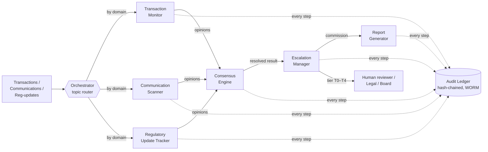

# Multi-Agent Compliance Monitoring System

| Field | Value |
|---|---|
| **Project** | 463548B — Agentic AI Compliance Monitoring System |
| **Client (fictional)** | Meridian Global Bank |
| **Author** | Aman Singh (Zetheta intern) |
| **Version** | 1.1.0 · **Date** 2026-09-05 |
| **Deliverables** | D1–D7 design docs + D8 detection-core extension + runnable Python reference implementation |
| **Status** | Complete — all 20 scenarios reproduced, 99 tests passing, audit chain tamper-evident |

---

## 1. What this is

A design specification **and** a working reference implementation for a multi-agent system that monitors a large bank's trading, communications, and regulatory activity for compliance violations. Four specialist agents each watch their own domain, a consensus engine reconciles their opinions when they overlap or disagree, a human-in-the-loop escalation framework routes every result to the right level of human review, and a tamper-evident audit ledger records the whole chain so a regulator can reconstruct exactly *what* was decided and *why* — years later.

The system is designed around one non-negotiable property for regulated surveillance: **every automated decision is deterministic, explainable, and reproducible.** Given the same inputs, two independent implementers must get identical outputs, and a lawyer must be able to explain the reasoning. That requirement drives most of the design choices below (see §7).

The design documents (`docs/`) are the primary deliverable. The `src/` implementation is a **lightweight, readable, pure-standard-library reference** that proves the design is internally consistent: it runs all 20 assessment scenarios end to end and reproduces every locked outcome, then demonstrates that the audit trail detects tampering.

## 2. System at a glance



The pipeline for one case is always the same six steps: **ingest → route → detect → reach consensus → escalate → report**, with **every** step written to the append-only audit ledger. Because the path is identical for all 20 scenarios, the behaviour is reproducible and the audit trail is complete by construction.

The **detect** step is itself a **two-tier detection core** (D8, `src/detection/`): each agent *computes* its opinion from the raw signal rather than replaying a fixed value — a normalization pipe standardises the input, deterministic guardrails apply zero-latency bright-line checks, and an agentic evaluator (with pluggable, deterministic-by-default backend) emits a structured verdict (`PASS`/`FLAGGED`/`VIOLATION`), a 0–100 risk score, and a Chain-of-Thought. After escalation, a **human-in-the-loop router** sends high-risk or low-confidence cases to the right human queue. This is additive: opinions are computed to reproduce the same locked outcomes exactly (`confidence = risk-score / 100`), so consensus, escalation and audit behaviour are unchanged. See `docs/detection/detection-core.md`.

## 3. The agents and coordination components

**Four specialist agents** (spec Part A, "the four required agents"):

- **Transaction Monitor (TM)** — market-abuse and AML surveillance over trades: spoofing, wash trading, front-running, late trading, structuring, concentration, best-execution. Authority `0.95` in trading.
- **Communication Scanner (CS)** — intent and content of communications: misleading statements, information-barrier breaches, off-channel comms, coercion, *and the absence of expected communications*. Authority `0.95` in communications, `0.90` in record-keeping. (Naming note: the agent is "CS"; the scenario IDs `CS-01…CS-20` use "CS" as an unrelated scenario prefix — see §9, Error 1's neighbours and `src/domain.py`.)
- **Regulatory Update Tracker (RU)** — regulatory change, interpretation, and cross-jurisdiction conflict. Authority `0.95` in regulatory, `0.75` in sanctions/AML.
- **Report Generator (RG)** — assembles the regulator-facing case report; it does not vote.

**Four coordination components:**

- **Orchestrator** — topic-based publish/subscribe router; keeps the decision chain reconstructable and lets agents be added/removed without rewiring peers.
- **Consensus Engine** — reconciles multiple opinions via an explicit hybrid rule (§4).
- **Escalation Manager** — turns a consensus result into a routing tier (T0–T4) plus SLA clock, and applies "raise-only" safety triggers.
- **Audit Ledger** — hash-chained, append-only (WORM) record of every event.

## 4. How decisions are made (the short version)

Full treatment is in `docs/conflict-resolution/` and `docs/escalation/`; the reference implementation is `src/consensus.py` and `src/escalation.py`. In brief:

1. **One agent only → passthrough.** Use that agent's severity and confidence directly.
2. **Agents agree (within one severity level) → Dempster–Shafer combination.** Two independent, moderately-confident signals *corroborate* into higher confidence over the frame Θ = {Violation, Benign}. Each agent's mass is discounted by its domain authority. This is what lifts CS-01 from two HIGH opinions to a CRITICAL @ 0.92 consensus.
3. **Agents genuinely disagree (>1 level apart) → weighted voting** with a margin/conflict test. If the winner is not clear (`margin < 0.20`) or conflict is high (`K > 0.60`), the case is **UNRESOLVED** and escalates to a human *at the higher-severity tier* — the legally safe default.
4. **An authenticated benign verification → suppression path.** If exculpatory evidence outweighs suspicion (belief in Violation `< 0.30`), the alert is suppressed as NO_ALERT — *with documented reasoning and an audit entry* (this is CS-18, the false-positive test).
5. **Conflict-of-laws (C5) → jurisdictional bypass.** Genuine cross-jurisdiction legal conflicts are *never* auto-resolved; they route straight to Legal (this is CS-19).

The routing **tier** is then `tier = max(confidence-band tier, severity-floor tier)`, and special triggers (SAR/sanctions clocks, control override, senior-subject conflict, jurisdictional conflict) can only ever *raise* it, never lower it. Fixed constants: `τ_assert = 0.25`, `δ_margin = 0.20`, `κ_conflict = 0.60`, `suppression_threshold = 0.30`. No randomness, no wall-clock dependence.

**Audit integrity.** Each ledger entry stores `prev_hash` and an `entry_hash = SHA-256(prev_hash ‖ sequence ‖ payload)`, forming a chain where altering any past entry breaks every hash after it. Entries are also signed (HMAC-SHA256, used here as an explicitly-documented stand-in for ECDSA P-256 — see `docs/observability/audit-trail.md`). The ledger is append-only (WORM), satisfying the intent of SEC Rule 17a-4(f).

## 5. Repository map

| Deliverable | Location | Contents |
|---|---|---|
| **README** | `README.md` (this file) | Overview, navigation, run instructions, tech justification, error report |
| **Self-assessment** | `SELF-ASSESSMENT.md` | Scoring against the rubric + badge claims |
| **D1 — Architecture** | `docs/architecture/` | `system-topology.md`, `data-flow.md`, `agent-registry.md`, `failure-modes.md`, `security-architecture.md` |
| **D2 — Communication protocol** | `docs/protocols/` | `communication-protocol.md`, `routing-logic.md`, `message-schema.json` |
| **D3 — Consensus & conflict** | `docs/conflict-resolution/` | `consensus-algorithm.md`, `conflict-taxonomy.md` |
| **D4 — Escalation** | `docs/escalation/` | `escalation-framework.md` + `decision-trees/` (master, critical-filing, false-positive, jurisdictional) |
| **D5 — Agent specs** | `docs/agents/` | one spec per agent + `capability-matrix.md` |
| **D6 — Scenario trace-throughs** | `tests/scenarios/` | `CS-01.md … CS-20.md` + `scenario-summary.md` (the locked expected outcomes) |
| **D7 — Observability** | `docs/observability/` | `logging-spec.md`, `monitoring-dashboard.md`, `audit-trail.md`, `retention-policy.md` |
| **D8 — Detection core** (extension) | `docs/detection/` | `detection-core.md` — ingestion/normalization, deterministic guardrails, agentic evaluator, HITL routing |
| **Reference implementation** | `src/` | Agents, orchestrator, consensus, escalation, audit, `run_demo.py`, and the `detection/` package (normalization, guardrails, evaluator, hitl) |
| **Tests** | `tests/` | `test_scenarios.py`, `test_consensus.py`, `test_audit.py`, `test_detection.py` |

**Suggested reading order for a reviewer:** this README → `docs/architecture/system-topology.md` → `docs/detection/detection-core.md` → `docs/conflict-resolution/consensus-algorithm.md` → `docs/escalation/escalation-framework.md` → run the demo (§6) → `tests/scenarios/scenario-summary.md`.

## 6. Running the reference implementation

**Requirements:** Python 3.10+ only. The runtime uses **nothing outside the standard library** (`hashlib`, `hmac`, `json`, `dataclasses`, `enum`, `datetime`, `typing`). The single optional dependency is `pytest` for the test suite.

```bash
# from the repository root
python -m src.run_demo        # runs all 20 scenarios + audit tamper-evidence demo
```

Expected result: a table of all 20 scenarios (each row now also showing the case's computed detection verdict and where it was routed), `20/20 matched the locked expected outcomes`; then a **worked example of the two-tier detection core** on one signal (the deterministic pass, the evaluator's tool calls, the risk score, and the full Chain-of-Thought); then the **human-in-the-loop review queue** the run produced; then a three-line audit demonstration showing the intact chain verifies, a deliberate tamper is *detected*, and restoring the entry re-verifies — ending in `ALL CHECKS PASSED` (157 audit entries across all cases).

```bash
pip install pytest            # only dependency, only needed for the test suite
pytest -q                     # 99 tests: 23 scenario + 12 consensus + 8 audit + 56 detection
```

Every scenario's expected outcome lives in exactly one place — `src/scenarios.py` — and is shared by both the demo and the tests, so the trace-through docs (`tests/scenarios/`) and the code cannot silently drift apart.

## 7. Technology and framework choice

The brief left the framework open ("choose and justify"). **I deliberately did *not* adopt a general LLM-agent orchestration framework (e.g. LangGraph, AutoGen, CrewAI). Instead I implemented a lightweight, custom mediated-orchestrator architecture with a typed message bus and a deterministic consensus engine, in pure Python.** The justification is specific to compliance surveillance:

- **Determinism and reproducibility are legal requirements, not nice-to-haves.** Surveillance decisions can trigger SAR filings, transaction holds, and regulatory notifications. The design goal is that two independent implementers produce *identical* behaviour for the same inputs (spec Q&A). LLM-driven orchestration is stochastic by nature and cannot meet that bar for the *decision* layer.
- **Explainability to a lawyer/regulator.** A transparent rule (Dempster–Shafer combination, weighted voting with an explicit margin/conflict test, fixed thresholds) can be walked through line by line in front of the General Counsel persona. An opaque model chain cannot.
- **Auditability (SEC 17a-4).** The value of the system is only as good as its record. A hash-chained, append-only ledger with signed entries is simple to reason about and to prove tamper-evident; that is far easier to defend than reconstructing an agent framework's internal state.
- **Zero heavy dependencies → auditable and portable.** A pure-stdlib implementation has no supply-chain surface, runs anywhere with Python 3.10+, and every line can be explained in a viva. This directly serves the assessment's "implementation-ready, unambiguous" standard.

**Where ML *does* belong.** This separation is intentional, not a rejection of ML. In production the **detection layer** — NLP for communications intent, pattern/anomaly models for trading — would absolutely use machine learning, and each agent's spec (`docs/agents/`) describes those methods. What stays deterministic is the **coordination layer**: how opinions are combined, how cases are escalated, and how everything is recorded. ML proposes; the deterministic layer disposes and documents.

The **detection core (D8)** makes this concrete: its agentic evaluator scores through a pluggable `EvaluatorBackend`. The default `DeterministicBackend` is a transparent scorecard (so the graded system stays offline and reproducible), while `LLMBackend` shows exactly how a real model would slot in — structured JSON out — but is deliberately inert on the default path (it raises unless a client is injected). A model can therefore be swapped into detection without touching, or destabilising, the deterministic decision layer.

## 8. India regulatory coverage

Because the fictional client is headquartered in Mumbai with Indian operations, India-specific regulation is integrated into the design rather than bolted on: **SEBI** (LODR, PIT Regulations), **RBI** (KYC/AML Master Directions, data-localisation), and **PMLA / FIU-IND** SAR obligations appear in the agent specs, the sanctions/AML escalation path, and the security architecture (Aadhaar/eKYC tokenisation and RBI data-localisation are called out in `docs/architecture/security-architecture.md` and the Communication Scanner constraints). Cross-jurisdiction conflict handling (CS-19) explicitly models an EU–Singapore clash and routes it to Legal without auto-resolving.

## 9. Document Error Report

The assessment states it contains deliberately planted errors and awards **5 bonus points each, up to 25**, for identifying them with (a) location, (b) the error, and (c) the correction with an authoritative source. Five are documented below.

### Error 1 — "three primary topologies" but four are listed
- **Location:** Part A, Section A2.1 ("Agent Topologies"), p. 3.
- **Error:** The text reads *"The **three** primary topologies are:"* and then lists **four**: Centralised, Decentralised, Hierarchical, and Hybrid.
- **Correction:** The count should read **"four primary topologies,"** or the list should be reduced to three. This is verifiable by direct enumeration of the four bullet points in the same section. (Hybrid is a legitimate, widely-recognised fourth topology, so the correct fix is to change the number to "four.")

### Error 2 — "four case studies" but the document contains five
- **Location:** Part C ("Case Studies & Real-World Applications"), opening paragraph (p. 33).
- **Error:** The text reads *"The following **four** case studies are drawn from actual regulatory enforcement actions."* The document then presents **five** case studies: (1) JPMorgan Chase off-channel, (2) Wirecard AG, (3) Archegos Capital Management, (4) ICICI Bank, and (5) the 2023–2024 SEC/FINRA off-channel enforcement sweep.
- **Correction:** The count should read **"five case studies."** This is verifiable by direct enumeration of the numbered "Case Study 1 … Case Study 5" headings within the same document (Part C, pp. 33–39).

### Error 3 — CS-10 cites "SEC Section 17(j)" as a regulation distinct from the Investment Company Act
- **Location:** Part B, Section B4.1, Scenario CS-10 (Front-Running), "Applicable Regulations" (p. 25).
- **Error:** Lists *"SEC Section 17(j), Investment Company Act Section 17(j), FINRA Rule 5270"* — naming "17(j)" twice and attributing one instance to "SEC." The SEC is a regulator, not a statute with numbered sections; there is no free-standing "SEC Section 17(j)."
- **Correction:** The correct citations are **Section 17(j) of the Investment Company Act of 1940** (15 U.S.C. § 80a-17(j)) and the rule adopted under it, **SEC Rule 17j-1** (17 CFR § 270.17j-1), which govern personal-securities transactions / front-running by access persons. Front-running of client block orders is separately addressed by **FINRA Rule 5270** (Front Running of Block Transactions), which is correctly cited. The redundant "SEC Section 17(j)" should be removed.

### Error 4 — CS-05 cites the wrong MiFID II article for an information-barrier breach
- **Location:** Part B, Section B4.1, Scenario CS-05 (Chinese Wall Breach), "Applicable Regulations" (p. 24).
- **Error:** Cites *"MiFID II Article 33"* for a Chinese-wall / information-barrier breach. **Article 33 of MiFID II (Directive 2014/65/EU) concerns SME growth markets**, not conflicts of interest or information barriers.
- **Correction:** The MiFID II conflicts-of-interest obligation is **Article 23 of Directive 2014/65/EU**, and the detailed organisational requirements for information barriers ("Chinese walls") are set out in **Article 34 of Commission Delegated Regulation (EU) 2017/565**. (The scenario's other two citations — SEA 1934 § 15(g) and FINRA Rule 5280 — are appropriate.)

### Error 5 — CS-17 mislabels the Senior Safe Act as an SEC instrument
- **Location:** Part B, Section B4.2, Scenario CS-17 (Elder Financial Exploitation), "Applicable Regulations" (p. 26).
- **Error:** Cites *"SEC Senior Safe Act."* The Senior Safe Act is **not** an SEC rule or act.
- **Correction:** The **Senior Safe Act** was enacted as **Section 303 of the Economic Growth, Regulatory Relief, and Consumer Protection Act of 2018 (Pub. L. 115-174)**; it provides immunity to covered financial institutions and their supervised individuals who report suspected exploitation of senior citizens to regulators or law enforcement. It should be cited as the "Senior Safe Act (2018)," not attributed to the SEC. (The scenario's FINRA Rule 2165 and Rule 4512 citations are correct.)

### Additional observation (beyond the five above)
- **Location:** Part B — Section B6.1 (scoring buckets, p. 30) vs. Section B7 (Scenario Complexity Matrix, pp. 31–32).
- **Observation:** Section B6.1 places **CS-10 and CS-11 in the "Complex" (up to 11 points) bucket**, yet the B7 matrix rates **both as "Medium" complexity** — the same level as scenarios B6.1 puts in the 6-point "Standard" bucket. They are the only two scenarios whose scoring bucket and stated complexity disagree; every other 11-point scenario is rated "High." The two sections should be reconciled. (Noted as a possible sixth error; only the five above are claimed toward the 25-point cap.)

## 10. AI tools used

Per the assessment's disclosure requirement, this submission was produced with AI assistance (Anthropic Claude, Opus 4.x, operating as an agent in the Claude desktop app). AI was used to: draft and structure the design documents, implement the pure-Python reference code and tests (including the D8 two-tier detection core — ingestion/normalization, deterministic guardrails, the pluggable agentic evaluator, and HITL routing), cross-check the 20 scenario outcomes, and help identify candidate specification errors for §9. **All regulatory citations, the consensus mathematics, the scenario outcomes, and the error report were reviewed for accuracy against the specification and the author's own understanding, and are the author's responsibility.** The code is deliberately kept readable and heavily commented so that the author can explain every component in a viva; no black-box or generated-but-unexplained logic is included. AI-generated diagrams (Mermaid) were reviewed against the diagram standards in the brief.

## 11. Assessment traceability

See `SELF-ASSESSMENT.md` for a section-by-section mapping of deliverables to the rubric, the badge claims (including the "Error Spotter" badge earned via §9), and known scope decisions (Core Pass/Merit scope: all required deliverables present and correct, the four required agents, all 20 scenarios traced, plus a runnable reference implementation).

---
*End of README v1.1.0*
