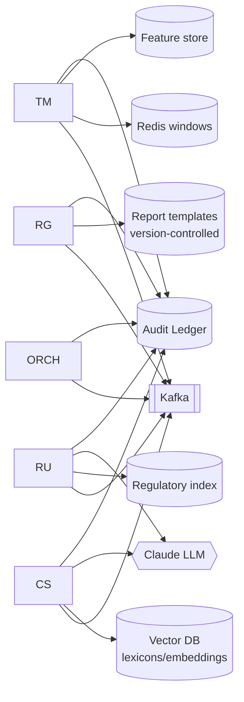

# D1.2 — Agent Registry

| Field | Value |
|---|---|
| **Document ID** | ARCH-REGISTRY |
| **Deliverable** | D1 — Multi-Agent System Architecture |
| **Version** | 1.0.0 |
| **Date** | 2026-08-21 |
| **Author** | Aman Singh |
| **Status** | Baseline |
| **Related** | [system-topology.md](system-topology.md) · [../agents/capability-matrix.md](../agents/capability-matrix.md) · [failure-modes.md](failure-modes.md) |

---

## 1. Purpose

The registry is the authoritative catalogue of every autonomous component in the System: its unique identifier, version, capabilities, resource envelope, scaling policy, and dependencies. The identifiers below are the single source of truth and are mirrored verbatim in `src/domain.py` (the agent-id constants), so documents and code cannot drift apart.

## 2. Identifier convention

`agent.<name>` for detection agents, `service.<name>` for shared services. Short codes (TM/CS/RU/RG) are used only in prose and diagrams.

> **Ambiguity removed (see README > Document Error Report):** the specification reuses "CS" for both the Communication Scanner agent and the compliance scenarios CS-01…CS-20. In this repository, the agent is always `agent.communication_scanner` (short code CS in prose only), and `CS-NN` refers exclusively to a scenario.

## 3. Registry table

| Agent ID | Short | Version | Primary responsibility | Detection domain(s) |
|---|---|---|---|---|
| `agent.orchestrator` | ORCH | 1.0.0 | Supervise workflow, open cases, invoke consensus + escalation, commission reports | none (coordination only) |
| `agent.transaction_monitor` | TM | 1.0.0 | Statistical/behavioural detection over transactions | Trading surveillance, AML, sanctions-exposure, concentration |
| `agent.communication_scanner` | CS | 1.0.0 | NLP surveillance of communications incl. **negative signal** (missing comms) | Comms surveillance, information barriers, record-keeping |
| `agent.regulatory_tracker` | RU | 1.0.0 | Track regulatory change, assess impact, detect cross-jurisdiction conflict | Regulatory change management |
| `agent.report_generator` | RG | 1.0.0 | Compile audience-specific reports & filing drafts | none (synthesis only) |
| `service.consensus_engine` | — | 1.0.0 | Resolve inter-agent disagreement deterministically | see D3 |
| `service.escalation_manager` | — | 1.0.0 | Route cases to human tiers, enforce SLAs, capture decisions | see D4 |
| `service.audit_ledger` | — | 1.0.0 | Append-only, hash-chained, WORM audit store | see D7 |

## 4. Capabilities & I/O contract (summary)

Full capability tables live in each agent's spec under `docs/agents/`. Summary contract:

| Agent | Consumes (input topics/msgs) | Produces (output msgs) | Confidence output |
|---|---|---|---|
| TM | `transactions`, `QUERY` | `ALERT`, `RESPONSE`, `HEARTBEAT` | calibrated 0.0–1.0 vs historical FP rate |
| CS | `communications`, `QUERY` | `ALERT`, `RESPONSE`, `HEARTBEAT` | calibrated 0.0–1.0 (per-lexicon / model) |
| RU | `reg-updates`, `QUERY` | `UPDATE`, `ALERT`, `RESPONSE`, `HEARTBEAT` | 0.0–1.0 (source authority weighted) |
| RG | commission requests, case bundle | report artefacts, filing drafts | n/a (validated, not scored) |
| ORCH | all agent messages | `QUERY`, `ESCALATION`, commission | n/a |

## 5. Resource envelope & scaling policy (target production)

Sizing is derived from the throughput calculations in [data-flow.md](data-flow.md) (peak factor 3× mean).

| Agent | CPU / replica | Mem / replica | Baseline replicas | Autoscale trigger | Max replicas | State |
|---|---|---|---|---|---|---|
| ORCH | 2 vCPU | 4 GB | 3 (active–passive) | leader only | 3 | in event log (stateless leader) |
| TM | 4 vCPU | 8 GB | 6 | consumer lag > 30s **or** CPU > 70% | 40 | stateless (windows in Redis/Flink) |
| CS | 4 vCPU + GPU pool | 12 GB | 8 | queue depth > 80% **or** P95 latency SLA breach | 60 | stateless (models loaded) |
| RU | 2 vCPU | 4 GB | 2 | schedule + feed volume | 8 | small (regulatory index) |
| RG | 2 vCPU | 6 GB | 3 | report queue depth | 20 | stateless (templates versioned) |

**Scaling principle:** all detection agents are **stateless** — their working state (rolling windows, model weights, lexicons) is either loaded at startup or held in shared stores (Redis, feature store, vector DB). This is what makes horizontal auto-scaling and instant failover possible; a replacement pod is functionally identical to the one it replaces.

## 6. Dependencies

## 7. Health & lifecycle

Every agent emits a `HEARTBEAT` message (default every 30s; configurable) carrying `status ∈ {RUNNING, DEGRADED, STOPPED}`, queue depth, and P50/P95/P99 latency. The Orchestrator and the System Health dashboard ([../observability/monitoring-dashboard.md](../observability/monitoring-dashboard.md)) consume these. Missing three consecutive heartbeats marks an agent `STOPPED` and triggers the failover path in [failure-modes.md](failure-modes.md).

## 8. Extensibility

Adding an agent (e.g. a dedicated Sanctions Screening Agent) requires only: (1) a new `AgentID`, (2) a capability entry here, (3) a boundary contract in the [capability matrix](../agents/capability-matrix.md), (4) subscription to the relevant topics. Because coordination is mediated by the Orchestrator and messages are schema-validated, existing agents need no change — an open/closed design.

---
*End of ARCH-REGISTRY v1.0.0*
