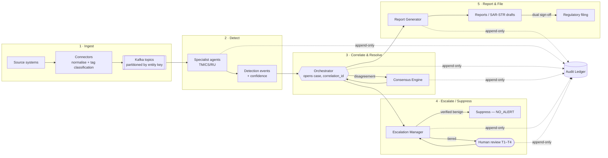

# D1.3 — Data Flow Architecture

| Field | Value |
|---|---|
| **Document ID** | ARCH-DATAFLOW |
| **Deliverable** | D1 — Multi-Agent System Architecture |
| **Version** | 1.0.0 |
| **Date** | 2026-08-21 |
| **Author** | Aman Singh |
| **Status** | Baseline |
| **Related** | [system-topology.md](system-topology.md) · [agent-registry.md](agent-registry.md) · [../protocols/routing-logic.md](../protocols/routing-logic.md) |

---

## 1. End-to-end data flow

Five stages: **Ingest → Detect → Correlate & Resolve → Escalate/Suppress → Report & File.** Every stage writes to the Audit Ledger (dashed) so the chain is reconstructable end-to-end.

## 2. Source → agent routing

| Source system | Kafka topic | Partition key | Primary consumer | Secondary (on QUERY) |
|---|---|---|---|---|
| Trading / OMS | `transactions` | account_id | TM | CS (comms link), RU (threshold rule) |
| Email / IM / WhatsApp / voice transcripts | `communications` | employee_id | CS | TM (linked trades) |
| Federal Register, FCA, SEBI, OFAC SDN | `reg-updates` | jurisdiction | RU | TM/CS (rule recalibration) |
| Inter-agent messages | `agent-messages` | correlation_id | ORCH | — |
| Escalations | `escalations` | case_id | Escalation Manager | — |

Partitioning by entity key (account, employee, jurisdiction) **preserves per-entity ordering** — essential because many violations are defined by a *sequence* of events (e.g. layering, structuring). Cross-entity patterns are handled by the windowed correlation layer (§4), not by single-partition ordering.

## 3. Throughput budget (peak-volume feasibility)

Meridian's stated volumes and the derived engineering targets. *(We do not process real volume in this project — per the FAQ we demonstrate the architecture could.)*

| Stream | Daily volume | Mean rate (24h) | Business-hours mean (~8h) | Design target (peak ≈ 3× bh-mean) |
|---|---|---|---|---|
| Transactions | 2,400,000 | ≈ 27.8 /s | ≈ 83 /s | **300 /s** sustained, 500 /s burst |
| Communications | 850,000 | ≈ 9.8 /s | ≈ 30 /s | **100 /s** sustained, 150 /s burst |
| Regulatory updates | ~200 /day | ~0.002 /s | n/a | batch; near-zero real-time load |

**Sizing implication.** At 300 txn/s, one TM replica sized for ~50 txn/s (allowing headroom for windowed features) needs 6 baseline replicas; Kafka partitions ≥ 12 on `transactions` so consumer parallelism can grow to the 40-replica ceiling in [agent-registry.md](agent-registry.md). CS is the expensive path (LLM/NLP): sizing at ~15 msg/s per GPU-backed replica → 8 baseline replicas for 100 msg/s, scaling to 60 for surge.

## 4. Real-time vs. batch (the core trade-off)

Not every violation can be judged from a single event. The System uses a **three-lane** processing model:

| Lane | Latency target | Patterns it serves | Example scenarios |
|---|---|---|---|
| **Real-time (event)** | < 1 s | Single-event or short-fuse patterns; anything with a regulatory clock | Sanctions hold (CS-09), spoofing cancels (CS-02), late-trading timestamps (CS-14) |
| **Streaming windows** | seconds–minutes | Rolling-window aggregates (1h/4h/1d/5d/20d/60d) | Structuring (CS-04), wash trading (CS-06), concentration (CS-12) |
| **Batch / scheduled** | minutes–hours | Long-horizon or corpus-wide analysis | Front-running edge over 3 months (CS-10), best-execution over 90 days (CS-15), off-channel metadata sweeps (CS-13) |

A detection can **start** in the streaming lane and be **confirmed** by a batch recompute; the Orchestrator keeps the case open across lanes using the `correlation_id`. This is why the message schema carries `correlation_id` and `trace_id` — they stitch a case together across time and lanes.

## 5. Data classification tags

Every event is tagged at ingest with a **classification** that follows it through the pipeline and controls storage, retention, and residency:

| Tag | Meaning | Controls |
|---|---|---|
| `PII` | Personal data (GDPR/CCPA/PDPA) | encryption at rest, minimisation, privilege screen before human view |
| `IN-PAYMENT` | Indian payment data | **must stay in `ap-south`** (RBI localisation) |
| `PRIVILEGED?` | Possibly attorney-client / work-product | quarantined pending legal clearance (CS cannot decide privilege alone) |
| `REGULATORY` | Feeds retention class REGULATORY (7–10 yr) | WORM, hash-chained |

## 6. Backpressure & loss-prevention

Because Kafka persists before any agent reads, a slow or failed agent creates **consumer lag**, not data loss. Backpressure policy (detailed in [../protocols/routing-logic.md](../protocols/routing-logic.md)): when lag exceeds threshold the autoscaler adds replicas; if the ceiling is hit, lower-priority (priority 4–5) traffic is shed to a spill topic and replayed off-peak, while priority 1–2 (CRITICAL/HIGH) is never shed. No compliance-relevant event is dropped — it is at worst delayed and flagged with an SLA-risk marker.

---
*End of ARCH-DATAFLOW v1.0.0*
