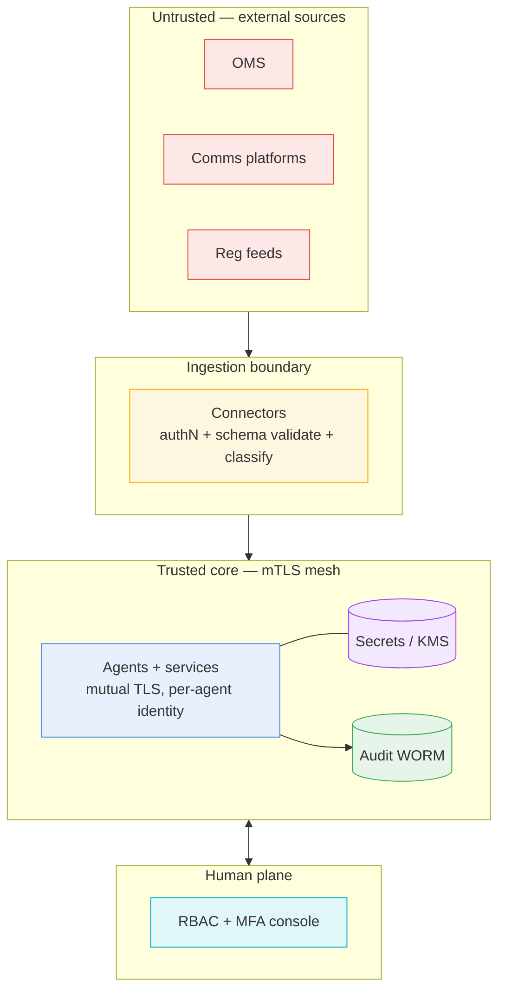

# D1.4 — Security Architecture

| Field | Value |
|---|---|
| **Document ID** | ARCH-SECURITY |
| **Deliverable** | D1 — Multi-Agent System Architecture |
| **Version** | 1.0.0 |
| **Date** | 2026-08-21 |
| **Author** | Aman Singh |
| **Status** | Baseline |
| **Related** | [system-topology.md](system-topology.md) · [../observability/audit-trail.md](../observability/audit-trail.md) · [../protocols/communication-protocol.md](../protocols/communication-protocol.md) |

---

## 1. Security objectives

The System handles material non-public information, PII, and evidence that may be produced to regulators or courts. Its security design targets five objectives: **confidentiality**, **integrity** (including non-repudiation of every agent decision), **availability** during trading hours, **auditability**, and **data sovereignty** (India localisation). Controls below are organised by trust boundary.

## 2. Trust boundaries

## 3. Agent authentication — mutual TLS + workload identity

Every agent and service has its own **X.509 identity certificate** issued by an internal CA (SPIFFE/SPIRE-style workload identity). All inter-agent traffic runs over **mutual TLS (mTLS)**: both sides present and verify certificates, so an agent can prove *which* peer it is talking to and no unauthenticated process can join the mesh. Certificates are short-lived (≤ 24h) and auto-rotated; revocation is immediate via the CA.

- **Transport:** TLS 1.3 only; strong cipher suites; certificate pinning within the mesh.
- **Message-level:** in addition to transport security, every message is signed (see §5) so authenticity survives even if it is later read from the log rather than received live.

## 4. Encryption

| Data state | Control |
|---|---|
| In transit | TLS 1.3 (mTLS inside mesh); external feeds over TLS with pinned CAs |
| At rest | AES-256-GCM for all stores (Kafka log, WORM, vector DB, feature store); envelope encryption via KMS |
| Key management | Hardware-backed KMS/HSM; per-classification data keys; keys never leave the HSM boundary; rotation policy documented and audited |
| In use (sensitive NLP) | PII minimisation + tokenisation before it reaches the LLM; privileged content quarantined (never sent to a third-party model) |

## 5. Message integrity & non-repudiation

Each message carries `sender_signature` (base64) and a `nonce`:

- **Signature:** the sender signs a canonical hash of the envelope+payload with its private key using **ECDSA P-256** (or RSA-2048 where hardware dictates). Any recipient — or an auditor years later — can verify the message was produced by that agent and not altered. This gives **non-repudiation**: an agent cannot deny a decision it signed.
- **Nonce + `ttl_seconds`:** a one-time value plus time-to-live defeats **replay attacks** — a captured message cannot be re-injected, because its nonce is already spent and/or its TTL has expired.
- Signatures and the resulting audit entries feed the hash-chain in [../observability/audit-trail.md](../observability/audit-trail.md).

## 6. Access control (human plane)

- **RBAC** with least privilege. Roles map to escalation tiers: Analyst, Senior Analyst, Manager, Director/CCO, plus Auditor (read-only) and Legal (privilege review).
- **MFA** mandatory for all human access; step-up auth for override actions and any filing sign-off.
- **Dual control:** no regulatory filing leaves the System without **two** authorised human sign-offs (RG constraint). Overrides above Tier 2 require a second approver.
- **Separation of duties:** the person who reviews a case cannot be the sole person who authorises its filing; Auditor role can read everything but write nothing.
- **Segregation for conflicts of interest:** if an escalation implicates a member of the normal escalation chain (e.g. a compliance officer is the subject — Case Study 5), the Escalation Manager reroutes around that person to an independent tier (see [../escalation/escalation-framework.md](../escalation/escalation-framework.md) §Conflict-of-interest rerouting).

## 7. Data sovereignty (India localisation)

RBI mandates that payment data for transactions in India be stored only on servers in India. Enforcement:

1. Connectors tag Indian payment events `IN-PAYMENT` at ingest.
2. `IN-PAYMENT` data is produced only to India-region (`ap-south`) Kafka partitions and India-region stores.
3. A residency policy engine **blocks** cross-region replication of `IN-PAYMENT` payloads; only non-restricted derived metadata (e.g. an alert reference, no raw payment data) may cross regions for global oversight.
4. Aadhaar/eKYC identifiers are tokenised at ingest under the Aadhaar Act / PMLA rules; raw identifiers never enter the analytical path.

## 8. Threat model (STRIDE summary)

| Threat | Mitigation |
|---|---|
| **S**poofing an agent | mTLS + workload identity certs |
| **T**ampering with a decision/log | message signatures + hash-chained WORM audit trail |
| **R**epudiation | ECDSA signatures = non-repudiation |
| **I**nformation disclosure | AES-256 at rest, TLS 1.3, PII tokenisation, privilege quarantine |
| **D**enial of service | Kafka buffering + autoscaling + priority-based load shedding (never sheds CRITICAL/HIGH) |
| **E**levation of privilege | RBAC least-privilege, MFA, dual control, separation of duties |

## 9. Compliance mapping

Security controls trace to specific obligations: SEC Rule 17a-4(f) (WORM immutability, §5 + audit-trail doc), GDPR Art. 32 (encryption/integrity, §4), RBI payment-data localisation (§7), PMLA/Aadhaar tokenisation (§7). This mapping is what earns the External Auditor persona's sign-off.

---
*End of ARCH-SECURITY v1.0.0*
