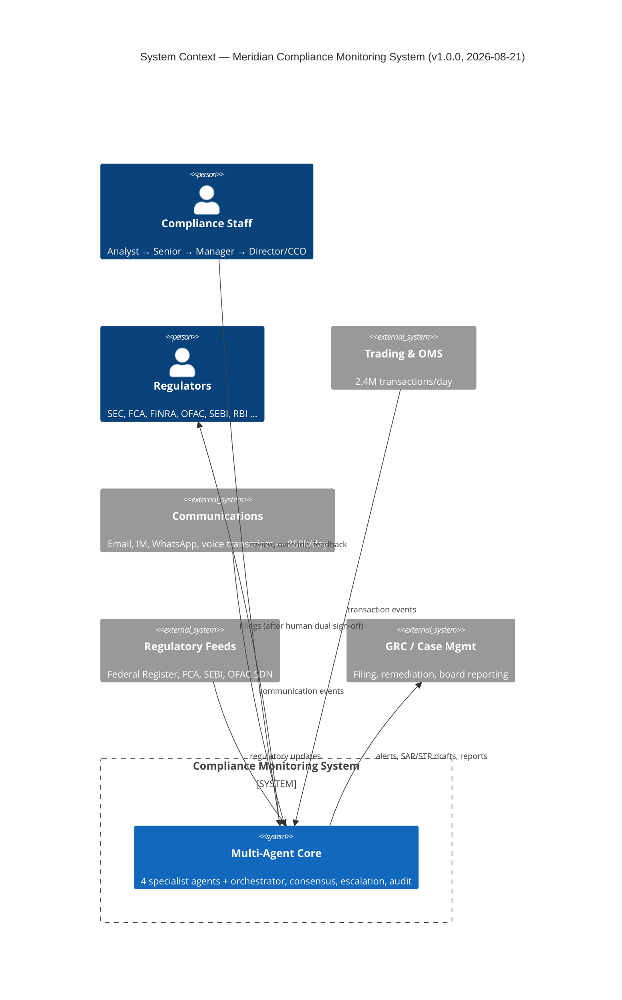
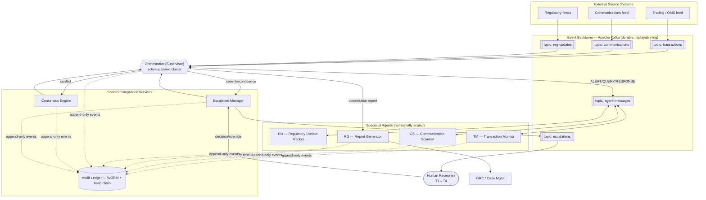
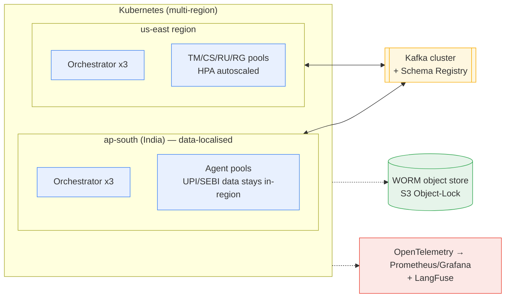

# D1.1 — Multi-Agent System Topology

| Field | Value |
|---|---|
| **Document ID** | ARCH-TOPOLOGY |
| **Deliverable** | D1 — Multi-Agent System Architecture |
| **Version** | 1.0.0 |
| **Date** | 2026-08-21 |
| **Author** | Aman Singh (AI Systems Architect, Meridian Global Bank) |
| **Status** | Baseline |
| **Related** | [agent-registry.md](agent-registry.md) · [data-flow.md](data-flow.md) · [security-architecture.md](security-architecture.md) · [failure-modes.md](failure-modes.md) · [../protocols/communication-protocol.md](../protocols/communication-protocol.md) |

---

## 1. Purpose

This document defines the high-level topology of the Meridian Global Bank Multi-Agent Compliance Monitoring System (hereafter **"the System"**): which agents exist, how they are arranged, how they communicate, and how the arrangement survives failure. It is the anchor document for Deliverable D1; the four sibling documents expand the registry, data flow, security, and failure-mode detail.

## 2. Topology Decision

### 2.1 Options considered

The specification (Part A, §A2.1) describes four candidate topologies. They were evaluated against Meridian's constraints — 2.4M transactions/day, 850k communications/day, 23 regulators, and an audit obligation to *prove* every decision.

| Topology | Coordination | Fault tolerance | Auditability | Verdict for Meridian |
|---|---|---|---|---|
| Centralised | Simple | Single point of failure (SPOF) | Good (one log) | Rejected — one orchestrator crash halts all compliance |
| Decentralised (P2P) | Very complex | Excellent | Poor — no global view of a decision chain | Rejected — regulators require a reconstructable decision chain |
| **Hierarchical** | Moderate | Good (supervisor + workers) | **Excellent** (supervisor sees every step) | **Selected** |
| Hybrid | Moderate–complex | Excellent | Good | Adopted *partially* — see §2.3 |

### 2.2 Selected topology: **Hierarchical with a supervising Orchestrator**

A single **Compliance Orchestrator** (`agent.orchestrator`) supervises four specialist worker agents. The Orchestrator does **not** perform detection itself; it (a) routes source events to the correct specialist(s), (b) opens a **case** with a shared `correlation_id`, (c) invokes the Consensus Engine when specialists disagree, (d) drives the escalation decision, and (e) commissions the Report Generator. This mirrors how a real compliance department is organised — a supervising officer coordinating desk specialists — which makes the design defensible to the Compliance Review Board's front-office and regulatory members.

**Why hierarchical over the others:** compliance is legally required to be *explainable*. A hierarchical supervisor gives us one place where the full decision chain for a case is assembled and stamped into the audit ledger, satisfying SEC Rule 17a-4 reconstruction requirements. A pure decentralised mesh would be more resilient but would scatter the decision chain across peers, making regulatory reconstruction expensive and fragile.

### 2.3 Hybrid resilience overlay (removing the SPOF)

A naive hierarchical design makes the Orchestrator a SPOF. We remove that with three hybrid measures, so the design is *hierarchical for coordination, decentralised for survival*:

1. **Orchestrator runs as an active–passive cluster** (≥3 replicas, leader elected via the message broker's consensus group). Workflow state lives in the durable event log, not in the leader's memory, so a standby resumes an in-flight case from the last checkpoint.
2. **Workers can operate in "degraded autonomous mode"** if the Orchestrator is briefly unreachable: each specialist keeps emitting detections to the durable log with a `DEGRADED` flag; when the Orchestrator recovers it replays and correlates them. No detection is ever lost, only delayed.
3. **The message backbone is the system of record**, not any single agent. Because every event is persisted first (event sourcing), the topology can lose any node and rebuild state by replay.

## 3. C4 Level-1 — System Context

**Legend:** solid arrows = data/control flow; `Person` = human actor; `System_Ext` = system outside our build boundary; `System` = our build.

## 4. C4 Level-2 — Container / Agent View

**Legend:** `{{ }}` = supervisor; `[ ]` = agent/service; `[[ ]]` = Kafka topic; `[( )]` = durable store; `( )` = human actor; solid = message/data flow; dashed = audit write. Every arrow that crosses an agent boundary carries a schema-validated message ([../protocols/message-schema.json](../protocols/message-schema.json)).

## 5. Agent inventory (summary)

| Code | Agent | Role in one line | Full spec |
|---|---|---|---|
| ORCH | Orchestrator | Supervises workflow, opens cases, drives consensus + escalation | this doc + [agent-registry.md](agent-registry.md) |
| TM | Transaction Monitor | Detects trading/AML/sanctions patterns in transactions | [../agents/transaction-monitor.md](../agents/transaction-monitor.md) |
| CS | Communication Scanner | NLP surveillance of comms (content **and** absence of comms) | [../agents/communication-scanner.md](../agents/communication-scanner.md) |
| RU | Regulatory Update Tracker | Tracks regulatory change, impact, cross-jurisdiction conflict | [../agents/regulatory-tracker.md](../agents/regulatory-tracker.md) |
| RG | Report Generator | Compiles audience-specific reports + filing drafts | [../agents/report-generator.md](../agents/report-generator.md) |

Supporting services (Consensus Engine, Escalation Manager, Audit Ledger) are shared infrastructure rather than detection agents; they are specified in D3, D4, and D7 respectively.

## 6. Communication backbone (why Kafka)

The backbone is **Apache Kafka** for transaction/communication/regulatory event streams and inter-agent messages, with **Redis Streams** for sub-second heartbeats and operator alerting. Rationale is developed in the technology-justification section of the README, but in brief: Kafka's **durable, replayable, partitioned log** is simultaneously our messaging fabric *and* our event-sourcing store, which is exactly what an audit-grade compliance system needs — we get "reconstruct any historical state" (SEC 17a-4) for free from the same component that moves messages. Partitioning by instrument/account key preserves per-entity ordering while allowing horizontal throughput.

## 7. Communication patterns used

The System deliberately mixes patterns (Part A, §A2.2) rather than forcing one:

- **Event-driven / Publish-Subscribe** for source ingestion (transactions, comms, reg-updates) — natural fit, decouples producers from agents, absorbs bursts.
- **Request–Response** for `QUERY`/`RESPONSE` between the Orchestrator and a specialist when corroboration is needed (e.g. TM asks CS "any comms linking these accounts?").
- **Mediator pattern** for conflict resolution: the Orchestrator + Consensus Engine act as the mediator that collects competing assessments.
- **Contract-Net (lightweight)** only where more than one agent could own a task; the higher domain-authority agent "wins the bid" (see [../conflict-resolution/consensus-algorithm.md](../conflict-resolution/consensus-algorithm.md)).

## 8. Deployment view (target production)

**India data-localisation note (RBI):** all payment data for transactions *in India* is processed and stored only in the `ap-south` region. Cross-region replication carries a data-classification tag that blocks India payment payloads from leaving the region, satisfying the RBI storage-of-payment-data directive. This is enforced in [security-architecture.md](security-architecture.md) §Data Sovereignty.

## 9. How the topology satisfies each Review Board persona

| Board persona | Concern | Topology answer |
|---|---|---|
| Regulatory Affairs (ex-SEC) | Reconstructable decision chain | Supervisor assembles + hash-chains the full chain per case (§2.2) |
| CTO (enterprise architecture) | Scalability, fault tolerance | Horizontal worker pools + active–passive orchestrator + Kafka backbone (§2.3, §8) |
| Head of Trading | Latency, low false positives | Real-time path for TM (§6); verification step suppresses false positives ([../conflict-resolution/consensus-algorithm.md](../conflict-resolution/consensus-algorithm.md)) |
| General Counsel | Legal defensibility | Deterministic consensus + human dual sign-off before any filing (§5, D4) |
| External Auditor | Evidence completeness | Every boundary crossing is a schema-validated, audit-classified message written to WORM (§4) |

---
*End of ARCH-TOPOLOGY v1.0.0*
