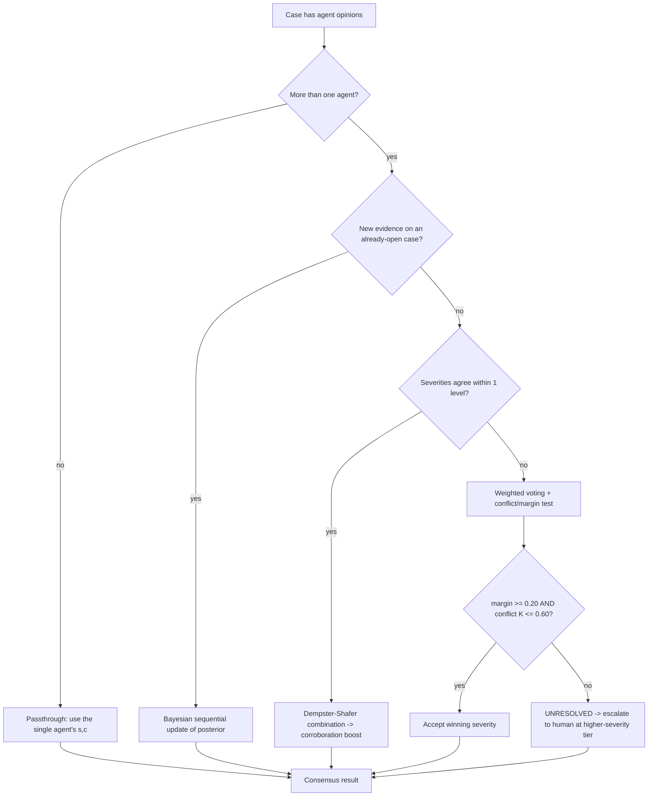

# D3.1 — Consensus & Conflict-Resolution Algorithm

| Field | Value |
|---|---|
| **Document ID** | CONFLICT-CONSENSUS |
| **Deliverable** | D3 — Conflict Resolution and Consensus Algorithm |
| **Version** | 1.0.0 |
| **Date** | 2026-08-21 |
| **Author** | Aman Singh |
| **Status** | Baseline |
| **Related** | [conflict-taxonomy.md](conflict-taxonomy.md) · [../escalation/escalation-framework.md](../escalation/escalation-framework.md) · reference impl `src/consensus.py` |

---

## 1. Design goal

When two or more agents assess the same case and reach different conclusions, the System must resolve the disagreement **deterministically** (two independent implementers, same inputs → identical output) and **defensibly** (a lawyer can explain *why* the machine decided as it did). We use a **hybrid** of three well-known mechanisms, each applied where it is strongest, chosen by an explicit selection rule.

## 2. Notation

For one case with `correlation_id` C and violation domain *d*, each participating agent *i* submits an opinion:

- `s_i` — asserted severity, mapped to an ordinal: `NO_ALERT=0, LOW=1, MEDIUM=2, HIGH=3, CRITICAL=4`
- `c_i ∈ [0,1]` — calibrated confidence (calibrated against that agent's historical false-positive rate for domain *d*)
- `w_i(d) ∈ [0,1]` — the agent's **domain-authority weight** (matrix in §3)
- `r_i ∈ [0,1]` — reliability calibration factor for this violation type (default 1.0)

**Effective weight:** `a_i = w_i(d) · r_i` (this is the Dempster–Shafer *discounting* factor).

## 3. Domain-authority matrix

Authority encodes "whose opinion counts more in this domain." Values are design choices grounded in each agent's mandate.

| Domain *d* | TM | CS | RU |
|---|---|---|---|
| Trading patterns (spoofing, wash, front-running, late trading, concentration) | **0.95** | 0.20 | 0.30 |
| Communications content/intent (misleading, coercion, info-barrier) | 0.15 | **0.95** | 0.25 |
| Record-keeping / off-channel | 0.35 | **0.90** | 0.30 |
| Regulatory change / interpretation / cross-jurisdiction conflict | 0.30 | 0.30 | **0.95** |
| Sanctions / AML (shared) | 0.70 | 0.40 | 0.75 |

## 4. Selection rule (which mechanism)



## 5. Mechanism A — Dempster–Shafer combination (agreement / corroboration)

**Frame of discernment** Θ = { V (violation), B (benign) }. Each agent's opinion becomes a *basic probability assignment* (mass function), discounted by its effective weight `a_i`:

```
m_i({V}) = a_i · c_i                 # belief committed to "violation"
m_i({B}) = a_i · (1 − c_i)   ONLY if the agent explicitly verified benign
m_i(Θ)   = 1 − m_i({V}) − m_i({B})   # residual ignorance ("don't know")
```

By default agents commit the remainder to ignorance Θ, not to B — a surveillance agent *raises suspicion*; it does not assert innocence unless it ran an explicit verification (this matters for CS-18).

**Dempster's rule of combination** for two masses m₁, m₂:

```
K = Σ_{Y∩Z=∅} m₁(Y)·m₂(Z)                      # conflict mass
m₁₂(X) = ( Σ_{Y∩Z=X} m₁(Y)·m₂(Z) ) / (1 − K)   for X ≠ ∅
```

Combine agents pairwise (order-independent — the rule is commutative & associative). The **consensus confidence** is `Belief(V) = m({V})`; plausibility `Pl(V) = m({V}) + m(Θ)` is an upper bound used for diagnostics.

**Resolved severity (agreement path):** `s* = max{ s_i : a_i·c_i ≥ 0.25 }` — the worst credible severity among agents that assert it (conservative). If none assert, `s* = NO_ALERT`.

### 5.1 Worked example — CS-01 (insider trading, TM + CS agree)

```
TM: insider-trading, s=HIGH(3),   c=0.72, w_TM(trading)=0.95 -> a=0.95
CS: corroborating dinner email,   c=0.80, w_CS(comms)  =0.95 -> a=0.95  (linkage evidence)

m_TM({V}) = 0.95·0.72 = 0.684 ; m_TM(Θ) = 0.316
m_CS({V}) = 0.95·0.80 = 0.760 ; m_CS(Θ) = 0.240
No {B} mass  ->  K = 0

m({V}) = 0.684·0.760 + 0.684·0.240 + 0.316·0.760
       = 0.51984 + 0.16416 + 0.24016 = 0.92416
m(Θ)   = 0.316·0.240 = 0.07584
Belief(V) = 0.924  ->  consensus confidence ≈ 0.92
Resolved severity s* = max(HIGH asserted by TM, elevated by corroboration) = CRITICAL
```

Each agent is weighted by its authority in the domain of *its own* evidence — TM in trading (0.95), CS in communications (0.95) — not by a single case-wide domain. Two independent, moderately-confident signals combine into a high-confidence CRITICAL: exactly the intuition that corroboration should *increase* certainty. Result: CRITICAL @ 0.92 → Tier-4 escalation, SAR path.

## 6. Mechanism B — Weighted voting (genuine conflict)

Used when severities differ by more than one level (e.g. TM says CRITICAL, risk-system view says NO_ALERT — the Archegos pattern).

```
score(s) = Σ_{i : s_i = s} a_i · c_i          # weighted votes per severity class
ŝ        = argmax_s score(s)                  # provisional winner
margin   = ( score(ŝ) − score(runner_up) ) / Σ_s score(s)
K        = Dempster conflict between the two leading opinions
```

**Decision rule:**
- If `margin ≥ 0.20` **and** `K ≤ 0.60` → **accept ŝ**, confidence = `score(ŝ) / Σ score`.
- Else → **UNRESOLVED** → escalate to a human at the tier implied by the **higher-severity** opinion (never the lower). Genuine, close disagreement on a serious matter always reaches a human — the legally safe default.

## 7. Mechanism C — Bayesian sequential update (evidence over time)

For an already-open case receiving new evidence (streaming → batch confirmation), maintain the posterior probability of violation using odds form:

```
prior_odds      = P(V) / (1 − P(V))                 # base rate for this violation type
posterior_odds  = prior_odds · Π_k LR_k             # LR_k = P(e_k|V) / P(e_k|B)
P(V | e) = posterior_odds / (1 + posterior_odds)
```

Each new agent finding contributes a likelihood ratio `LR`. The updated `P(V|e)` is re-banded into a severity/confidence and re-evaluated for escalation. Deterministic given the same evidence and LR table.

## 8. Tie-breaking & unresolvable conflicts

1. **Severity tie (equal scores):** choose the **higher** severity (conservative).
2. **Authority tie within a domain:** defer to the agent with the lower historical false-positive rate; if still tied, escalate.
3. **Unresolvable (margin < 0.20 or K > 0.60):** escalate to human at the higher-severity tier; attach both opinions and the conflict metrics to the decision-support package.
4. **Consensus Engine unavailable:** fail-safe → treat as unresolved → escalate (never auto-suppress).

## 9. Determinism & auditability

The algorithm uses only the inputs `{s_i, c_i, w_i(d), r_i}` and fixed constants `{τ_assert=0.25, δ=0.20, κ=0.60}`. No randomness, no wall-clock dependence. Every consensus computation writes an audit entry containing all inputs, the mechanism selected, intermediate masses/scores, and the output — so any decision can be independently recomputed and verified years later. This is what makes automated decisions legally defensible (General Counsel persona) and reproducible (SEC 17a-4).

---
*End of CONFLICT-CONSENSUS v1.0.0*
