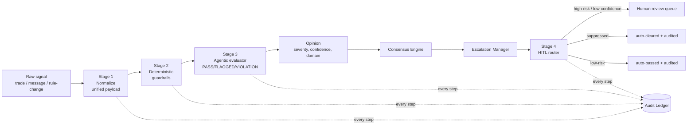
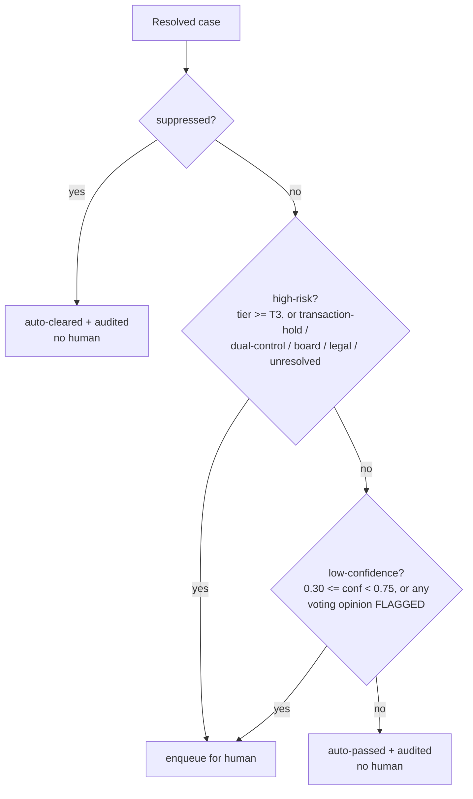

# D8 — Two-Tier Detection Core & Human-in-the-Loop Routing

| Field | Value |
|---|---|
| **Document ID** | DETECTION-CORE |
| **Deliverable** | D8 (extension) — Detection Core: ingestion, deterministic guardrails, agentic evaluator, HITL |
| **Version** | 1.0.0 |
| **Date** | 2026-09-05 |
| **Author** | Aman Singh |
| **Status** | Baseline |
| **Related** | [../conflict-resolution/consensus-algorithm.md](../conflict-resolution/consensus-algorithm.md) · [../escalation/escalation-framework.md](../escalation/escalation-framework.md) · [../observability/audit-trail.md](../observability/audit-trail.md) · reference impl `src/detection/` |

---

## 1. Design goal — *compute an opinion, don't replay one*

The coordination layer (consensus, escalation, audit) is deliberately deterministic and is specified in D3–D4. This document specifies the layer **before** it: how each specialist agent turns a **raw compliance signal** into the structured opinion (`severity`, `confidence`, `domain`) that consensus consumes.

The design requirement is precise: an agent must **derive** its opinion from evidence — the fields of a trade, the text of a message, the terms of a rule change — through an inspectable pipeline, rather than emitting a pre-set number. At the same time, the derivation must be **deterministic and reproducible** (two independent implementers, same signal → identical verdict) so that it fits under the same SEC 17a-4 reproducibility guarantee as the rest of the system, and so it reproduces every locked scenario outcome exactly (§7).

We meet both requirements with a **two-tier detector** followed by a **human-in-the-loop router**:

1. **Ingestion & Normalization** — standardise heterogeneous raw signals into one canonical *unified audit payload*.
2. **Deterministic First Pass** — fast, zero-latency bright-line checks that need no model.
3. **Agentic Compliance Evaluator** — a tool-using evaluator that produces a structured verdict (`PASS` / `FLAGGED` / `VIOLATION`), a 0–100 risk score, a policy-mapped severity, and a Chain-of-Thought.
4. **Human-in-the-Loop (HITL) routing** — route high-risk or low-confidence results to the correct human queue; auto-clear or auto-pass the rest, always with an audit record.

The two-tier split (cheap bright-line rules first, nuanced evaluation second) is the industry-standard way to keep surveillance both cheap and accurate: the deterministic pass filters the obvious at microsecond cost and pins the non-negotiable bright lines, and the evaluator spends the "expensive" reasoning budget only where judgement is actually required.

## 2. Where it sits in the pipeline

The detector runs **inside each agent's `assess()`**, producing the opinion. The HITL router runs **once per case**, after consensus and escalation, on the resolved result.



Reference implementation: `src/detection/` (`normalization.py`, `guardrails.py`, `evaluator.py`, `hitl.py`, `__init__.py`). The per-signal stages are wired by `DetectionPipeline.run(correlation_id, source_agent, signal, context)`; the router is `HITLQueue.route(case_id, consensus, escalation, opinions)`.

## 3. Stage 1 — Ingestion & Normalization (the unified audit payload)

Raw signals arrive in three shapes — **transactions** (TM), **communications** (CS), **regulatory events** (RU). Before any rule can reason about them they are standardised into one canonical `NormalizedEvent` so every downstream stage consumes a single shape without special-casing the source.

**Canonical payload (`schema_version = "normalized-event.v1"`):**

| Field | Meaning |
|---|---|
| `correlation_id` | the case id — ties every event and decision together |
| `source_agent` | which agent observed the signal |
| `event_type` | `transaction` \| `communication` \| `regulatory_event` (inferred from the agent if not declared) |
| `domain` | the compliance domain the evidence sits in (drives consensus authority weighting) |
| `violation_candidate` | what surveillance *thinks* this might be (keys the policy lookup) |
| `features` | the raw, source-specific fields, preserved **verbatim** |
| `evidence_ref` | pointer to the underlying record/artifact |
| `no_auto_resolve` | `True` only for C5 conflict-of-laws events — must never auto-resolve |
| `event_id` | stable, deterministic `f"{correlation_id}:{source_agent}"` |

Two properties matter for audit:

- **Non-lossy.** The original raw fields are kept verbatim under `features`, so an auditor can always trace a decision back to the exact inputs.
- **Deterministic.** Normalisation never invents or randomises values. `observed_at` (a wall-clock timestamp) is recorded for provenance but is **deliberately excluded** from `audit_payload()` and from anything that feeds scoring — a detection result must never depend on the clock. A structurally invalid signal (missing `violation_type` or `domain`) raises `ValueError` so bad input fails fast and loudly rather than silently scoring to zero.

## 4. Stage 2 — Deterministic First Pass (guardrails)

Every normalised event is put through a bank of fast, zero-latency, fully deterministic checks — the **bright-line** rules of compliance, things that are true or false with no judgement required. Each deterministic indicator on a signal names a generic `check` plus its parameters; the engine runs the *real* predicate against the event's features, and if it fires, counts the indicator's risk `points` and records a fully-traced `GuardrailHit`.

**Check catalog (`GUARDRAIL_CHECKS`) — the indicators are data, the predicates are code:**

| Check | Fires when | Typical use |
|---|---|---|
| `equals`, `is_true`, `gt`, `ge`, `lt` | scalar comparison on a field | thresholds, boolean facts |
| `in_range` | `low ≤ field ≤ high` | pre-announcement window (CS-01) |
| `in_set` | field ∈ an enum | categorical facts |
| `regex` | pattern matches text (case-insensitive) | "guaranteed returns" marketing (CS-08) |
| `count_ge` | list length ≥ N | ≥3 deposits in a structuring pattern (CS-04) |
| `all_below` | every value in a list < threshold | sub-$10k structured deposits (CS-04) |
| `channel_is_personal` | channel ∈ `PERSONAL_CHANNELS` | off-channel comms |
| `on_sanctions_list` | counterparty ∈ `OFAC_SANCTIONS_DEMO` | sanctions nexus (CS-09) |
| `on_restricted_list` | instrument ∈ `RESTRICTED_WATCHLIST` | restricted-list trade (CS-01) |

The reference lists (`OFAC_SANCTIONS_DEMO`, `RESTRICTED_WATCHLIST`, `PERSONAL_CHANNELS`) are tiny fixed demo sets so the checks are runnable offline; in production they are live sanctions/restricted feeds behind the same interface.

**Two design properties:**

- **Hard stops.** An indicator marked `hard=True` (e.g. a confirmed sanctions match, sub-threshold structuring) is a violation *on its own* and must never be "reasoned away" downstream. `GuardrailResult.hard` propagates this into the evaluator's Chain-of-Thought as an explicit `[hard-stop]` line.
- **Misses are recorded, not silently dropped.** A declared deterministic indicator whose predicate does *not* fire is recorded in `misses`, so a mis-authored scenario is caught rather than silently under-scoring.

## 5. Stage 3 — Agentic Compliance Evaluator

Where the guardrails answer *"did a bright-line rule trip?"*, the evaluator answers the harder question: *"given everything we know, how confident are we that this is real, and how serious is it?"* It emits a **structured verdict** plus the reasoning behind it.

### 5.1 Verdict bands and risk score

```
score       = clamp(guardrail_points + agentic_points, 0, 100)
confidence  = round(score / 100, 2)
verdict     = VIOLATION  if score ≥ 75
              FLAGGED    if 30 ≤ score < 75
              PASS       if score < 30
```

The band edges are not arbitrary — they are the system's existing thresholds, so the detection layer speaks the same language as consensus/escalation: the `PASS` ceiling is `SUPPRESSION_THRESHOLD × 100 = 30`, and the `VIOLATION` floor `75` is the HIGH confidence band (0.75). `FLAGGED` is the FINRA/SEC "reasonable suspicion" middle — credible, not conclusive, human should look.

### 5.2 The two "tools"

The brief asks for an evaluator *"with tool access to query policy docs and inspect session context."* Both are modelled as deterministic, offline tools, and **every call is recorded in a `tool_trace`**:

- **`policy.lookup(violation_type)`** — the *"query policy docs"* tool. A `PolicyStore` maps a violation type to its **inherent regulatory severity** and the rules it implicates (e.g. `structuring → CRITICAL`, `spoofing → HIGH`, `regulatory_change → MEDIUM`), with an India overlay where relevant (PMLA, SEBI PIT, DPDP). Division of labour: **the evaluator scores *confidence*; the policy fixes *severity*.** An unknown violation type falls back to a conservative `MEDIUM` default.
- **`context.inspect(correlation_id)`** — the *"inspect session context"* tool. The evaluator sees the whole case, so it can note corroborating signals from sibling agents on the same `correlation_id`. Corroboration is *surfaced in the Chain-of-Thought for the human* and combined rigorously later by the consensus engine (Dempster–Shafer); it does **not** silently inflate the score, to avoid double-counting the same evidence twice.

### 5.3 Chain-of-Thought

The rationale is assembled in a fixed, auditable order: every deterministic hit (`[deterministic] rule: … (+pts)`), every agentic reason (`[agentic] rule: … (+pts)`), the policy citation (`[policy] … inherent severity …`), a `[hard-stop]` line if any bright-line fired, the final arithmetic (`[score] deterministic X + agentic Y = Z/100 → confidence → verdict`), and a `[no-auto-resolve]` line for conflict-of-laws events. This is exactly what a compliance officer and an auditor need to reconstruct the score from the record alone.

### 5.4 Pluggable backend — determinism preserved

The nuanced (agentic) portion of the score goes through an `EvaluatorBackend`:

- **`DeterministicBackend` (default).** A transparent, reproducible scorecard: the agentic score is the sum of the declared contextual indicators, plus a context-inspection note. No network, no randomness — this is what keeps the whole system offline-runnable and SEC 17a-4 reproducible, and it is what reproduces the locked outcomes (§7).
- **`LLMBackend` (documented, drop-in, never on the default path).** Shows exactly how a real LLM evaluator would be structured — `build_prompt()` returns the strict-JSON instruction (`{"verdict": PASS|FLAGGED|VIOLATION, "confidence": 0.0–1.0, "rationale":[…]}`) — but it is **deliberately inert unless a client is injected**: calling it without one raises `LLMBackendUnavailable`. A live model in the graded decision path would break determinism, reproducibility, and offline execution, so it is opt-in only. This realises the system-wide principle **"ML proposes; the deterministic layer disposes and documents"** at the level of a single pluggable component.

## 6. Stage 4 — Human-in-the-Loop routing

Automation decides; humans stay accountable. After consensus and escalation, `HITLQueue.route()` decides whether a human must see the case, and if so, puts it in the right queue at the right priority with the right SLA. It is duck-typed against `ConsensusResult` / `EscalationResult` so the detection package stays decoupled from those classes.

**Routing policy** (straight from the brief: *"route high-risk OR low-confidence"*):



- **Priority** = `clamp(5 − tier_value, 1, 5)` → T4 is P1 (most urgent), down to P5.
- **Queue assignment** (first match wins): legal hook or unresolved → **Legal & Compliance Review Board**; board reporting → **Board Risk Committee**; transaction hold or CRITICAL → **Senior Compliance Officer (Tier-1)**; HIGH → **Compliance Analyst (Tier-2)**; otherwise → **Compliance Analyst (Tier-3)**.
- **Never a silent drop.** Both non-human outcomes are *recorded*: a suppressed false positive (the CS-18 trap) is `auto_cleared`; a genuinely low-risk case is `auto_passed`. The orchestrator writes an audit entry for every outcome (`hitl.enqueued` or `hitl.auto_disposition`).

Across the 20 scenarios this produces **19 queued, 1 auto-cleared (CS-18), 0 auto-passed** — the suppressed false positive is the only case that needs no human, exactly as intended.

## 7. Reproducing the locked outcomes exactly

The detector is the mechanism by which agents now *compute* opinions, but it must still land on the outcomes locked in D6 (`tests/scenarios/`). Reproduction rests on three identities:

1. `confidence = score / 100`, and each signal's integer indicator points are authored to sum to exactly `preset_confidence × 100`.
2. `severity = PolicyStore.lookup(violation_type).severity` equals the preset opinion's severity for every violation type used.
3. `verdict = verdict_for_score(score)` is consistent with the bands in §5.1.

### 7.1 Worked example — CS-01, Transaction Monitor

```
raw = { instrument: "ACME", days_to_announcement: 17, adv_multiple: 4.1, ... }

Stage 2 — deterministic first pass:
  restricted_list_trade  on_restricted_list("ACME")            -> fires  +24
  pre_announcement_window in_range(17 in [1,21])               -> fires  +20
  guardrail_points = 44

Stage 3 — agentic evaluator:
  policy.lookup("insider_trading") -> severity = HIGH; rules = SEC 10b-5, FINRA 2010
  accumulation_vs_adv (agentic)                                +28
  agentic_points = 28

  score      = 44 + 28 = 72
  confidence = 0.72
  verdict    = FLAGGED           (30 <= 72 < 75)
  severity   = HIGH              (from policy)
```

This equals the locked TM opinion **HIGH @ 0.72**, computed entirely from the raw fields. Consensus then combines it with the CS opinion (HIGH @ 0.80) via Dempster–Shafer into the locked **CRITICAL @ 0.92** case outcome — see [consensus-algorithm.md §5.1](../conflict-resolution/consensus-algorithm.md). Every one of the 20 scenarios is verified this way by `tests/test_detection.py`, so if any indicator's points are ever mis-authored, the reproduction test fails loudly.

## 8. Determinism, cost/latency, and auditability

- **Determinism.** Every stage uses only the signal's fields, fixed catalog predicates, the fixed policy table, and the declared indicator points. No randomness, no wall-clock dependence in the scoring path. The default evaluator backend is deterministic; the LLM backend is inert without an injected client and therefore never on the graded path.
- **Cost / latency.** Bright-line checks are microseconds and need no model call, so they run first and cheaply; the nuanced evaluation runs second and only where judgement is needed. In production this is where an LLM/NLP or anomaly model would be swapped in behind the `EvaluatorBackend` interface without touching the coordination layer.
- **Auditability.** The normalised payload, the deterministic hits, the tool trace, the risk arithmetic, and the full Chain-of-Thought are all recorded (orchestrator writes `detection.evaluated` per computed opinion). A decision is reconstructable from the audit trail alone — the SEC 17a-4 explainability/reproducibility requirement the whole system is built around.

## 9. Mapping to the build brief

| Brief step | Realised by |
|---|---|
| "Build the Ingestion & Normalization Pipe: standardise agent inputs into a unified audit payload." | §3 — `normalization.py`, `NormalizedEvent.audit_payload()` |
| "Implement the Deterministic First Pass: lightweight, zero-latency checks before invoking LLM evaluators." | §4 — `guardrails.py`, `GuardrailEngine.first_pass()` |
| "Build the Agentic Compliance Evaluator: tool access to policy docs + session context; structured risk score (Pass/Flagged/Violation) + Chain-of-Thought." | §5 — `evaluator.py`, `ComplianceEvaluator.evaluate()` |
| "Enforce Human-in-the-Loop: route high-risk or low-confidence flags to a human reviewer queue." | §6 — `hitl.py`, `HITLQueue.route()` |

## 10. Regulatory grounding

The verdict bands and the policy severities are anchored to real obligations: the `FLAGGED` band models the FINRA/SEC "reasonable suspicion" standard that triggers enhanced review; hard stops model bright-line duties (a confirmed OFAC nexus forces a transaction hold; sub-threshold structuring starts the BSA/FinCEN SAR clock); the `no_auto_resolve` path models conflict-of-laws handling (route to Legal, never pick a side). HITL routing operationalises the supervisory-review expectations of **SEC Rule 17a-4** and **FINRA Rule 3110**, and the India overlay (PMLA/FIU-IND SAR, SEBI PIT, RBI KYC/AML, DPDP) is carried on the relevant policy entries.

## 11. Testing

`tests/test_detection.py` covers the core two ways:

- **Reproduction** — for every agent signal in every scenario, run the pipeline and assert the computed `severity` / `confidence` / `domain` equal the scenario's locked opinion, that `confidence == score/100`, and that `verdict` is consistent with the bands. This pins "compute, don't replay" to the D6 outcomes.
- **Unit** — each stage exercised in isolation: normalization (payload shape, event-type inference, validation), guardrails (each check, hard-stop flag, misses, unknown-check error), evaluator (band edges at 30/75, score clamp, policy mapping, tool trace, deterministic-by-default, LLM inert without a client), and HITL (suppression → auto-clear, high-tier → human, low-confidence → human, low-risk → auto-pass, legal/board queue assignment, priority sort).

---
*End of DETECTION-CORE v1.0.0*
