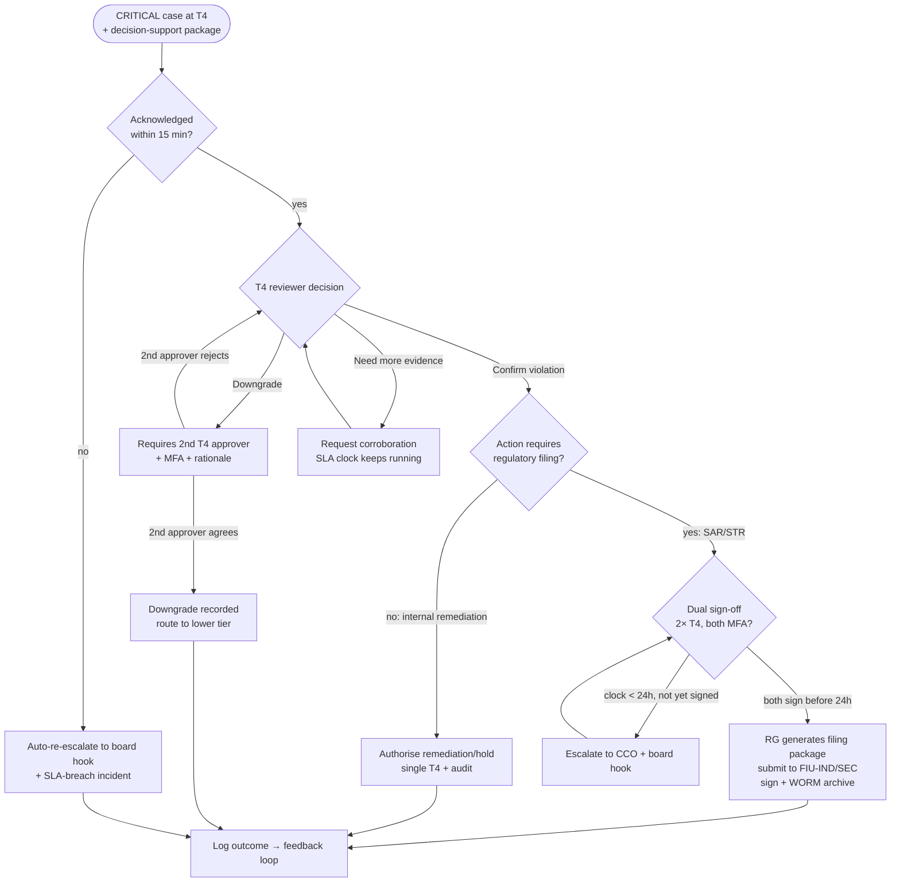

# Critical-Filing Decision Tree (SAR/STR path)

| Field | Value |
|---|---|
| **Document ID** | TREE-CRITICAL-FILING |
| **Deliverable** | D4 — Human-in-the-Loop Escalation Framework |
| **Version** | 1.0.0 · **Date** 2026-08-21 · **Author** Aman Singh |
| **Related** | [../escalation-framework.md](../escalation-framework.md) §5 (dual control) · [../../agents/report-generator.md](../../agents/report-generator.md) |
| **Scenarios** | CS-01, CS-04, CS-09, CS-14, CS-20 |

---

## What this tree decides

Once the master tree routes a **CRITICAL** case to **T4**, this path governs the *consequential action* — a regulatory filing (SAR/STR) or a trading hold. Its defining features are **dual control** (a filing needs two T4 sign-offs) and a **regulatory clock** that auto-re-escalates rather than letting a deadline slip. This is the JPMorgan/1MDB lesson encoded: no single actor can either file *or* quietly bury a critical case.

## Reading the outcome

Three guarantees make this path defensible. First, **dual sign-off** on any filing and **dual control** on any downgrade enforce separation of duties — the audit ledger shows two distinct authenticated approvers. Second, the **24-hour SAR clock** never silently expires: as it nears zero without sign-off, the case climbs to the CCO and board hook (`NUDGE`), so a missed deadline becomes an incident, not a gap. Third, every terminal branch feeds the **feedback loop**, so confirmed filings and downgrades both recalibrate agent confidence. The filing package itself is produced by the Report Generator and written to WORM storage with a hash-chained, signed audit entry (SEC 17a-4(f)).

---
*End of TREE-CRITICAL-FILING v1.0.0*
