# False-Positive Suppression Decision Tree

| Field | Value |
|---|---|
| **Document ID** | TREE-FALSE-POSITIVE |
| **Deliverable** | D4 — Human-in-the-Loop Escalation Framework |
| **Version** | 1.0.0 · **Date** 2026-08-21 · **Author** Aman Singh |
| **Related** | [../escalation-framework.md](../escalation-framework.md) §3.3 · [../../conflict-resolution/conflict-taxonomy.md](../../conflict-resolution/conflict-taxonomy.md) (C8) |
| **Scenarios** | CS-18 (the false-positive trap) |

---

## What this tree decides

CS-18 is the trap: a $450M block trade *looks* anomalous but is a legitimate pre-arranged, disclosed rebalancing. The correct output is **NO_ALERT** — and doing so incorrectly costs the scenario score. This tree encodes "verify before you escalate": an initial detection does **not** go straight to a human. A verification step looks for explicit exculpatory evidence, and only that evidence can commit benign mass `m({B})` in the Dempster–Shafer combination and drive suppression. Crucially, suppression is a **documented T0 decision**, not a silent drop.

```mermaid
flowchart TD
    DET([Agent detection fires<br/>e.g. TM: anomalous volume, c=0.68]) --> VER{Verification:<br/>exculpatory record found?}

    VER -- "no record" --> KEEP[No benign mass committed<br/>m&#123;B&#125;=0 → normal consensus]
    VER -- "yes: pre-arrangement +<br/>disclosed mandate, authenticated" --> MASS[Commit benign mass<br/>m&#123;B&#125; = a·&#40;confidence in record&#41;]

    MASS --> DS[Dempster–Shafer combine<br/>violation mass vs benign mass]
    DS --> BEL{Belief&#40;V&#41; below<br/>suppression threshold?}

    BEL -- "yes" --> SUPP[NO_ALERT / T0 suppression]
    BEL -- "no — residual suspicion" --> KEEP

    SUPP --> DOC[Write suppression reasoning:<br/>which record, which mandate,<br/>hashes, verifying source]
    DOC --> AUD[Signed audit entry<br/>+ feedback: confirmed true-negative]
    KEEP --> ESCN[Continue to master tree<br/>route to appropriate tier]
```

## Reading the outcome

The design intent is asymmetry: a surveillance agent *raises* suspicion but does not *assert innocence* — by default its unexplained remainder goes to ignorance `m(Θ)`, not to benign. Only an **explicit, authenticated verification** (the block-desk pre-arrangement record plus the disclosed rebalancing mandate) may commit `m({B})`, and only enough benign mass to pull `Belief(V)` below the suppression threshold yields NO_ALERT. This prevents both failure modes: escalating a benign trade (false positive → the Head-of-Trading persona's pain) and silently dropping a real one (the record must actually exist and authenticate). The `DOC` step is what distinguishes a *compliant* suppression from a dangerous one — the reasoning is auditable, so a regulator can later confirm the machine suppressed for a legitimate, recorded reason.

---
*End of TREE-FALSE-POSITIVE v1.0.0*
