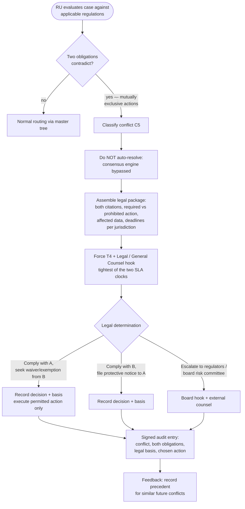

# Jurisdictional-Conflict Decision Tree

| Field | Value |
|---|---|
| **Document ID** | TREE-JURISDICTIONAL |
| **Deliverable** | D4 — Human-in-the-Loop Escalation Framework |
| **Version** | 1.0.0 · **Date** 2026-08-21 · **Author** Aman Singh |
| **Related** | [../escalation-framework.md](../escalation-framework.md) §3.3 · [../../conflict-resolution/conflict-taxonomy.md](../../conflict-resolution/conflict-taxonomy.md) (C5) |
| **Scenarios** | CS-19 (contradictory cross-border regulations) |

---

## What this tree decides

CS-19 pits two regulators against each other: one jurisdiction *requires* reporting an OTC transaction; another *prohibits* the cross-border data sharing that reporting would entail. This is conflict class **C5**, and the single most important rule is that the System **must not auto-resolve it** — no consensus arithmetic can weigh a legal contradiction. The Regulatory Update Tracker detects the contradiction, the case is forced to **T4 + a Legal hook**, and the System's role narrows to presenting *both* obligations with citations so counsel can make a legal determination.

## Reading the outcome

The tree deliberately **removes the machine's authority to decide** and replaces it with the machine's authority to *inform*. The `NOAUTO` node is the safety invariant: a C5 conflict skips the consensus engine entirely, because averaging or voting over contradictory legal duties would fabricate a false resolution. What the System *does* contribute is speed and completeness — it detects the contradiction the moment RU evaluates the case, packages both obligations with precise citations and per-jurisdiction deadlines, and honours the **tighter** of the two clocks so counsel isn't the reason a deadline slips. Every determination is audited with its legal basis and retained as precedent, so recurring conflicts (a known India-vs-EU data-sharing tension, say) resolve faster next time while still passing through a human.

---
*End of TREE-JURISDICTIONAL v1.0.0*
