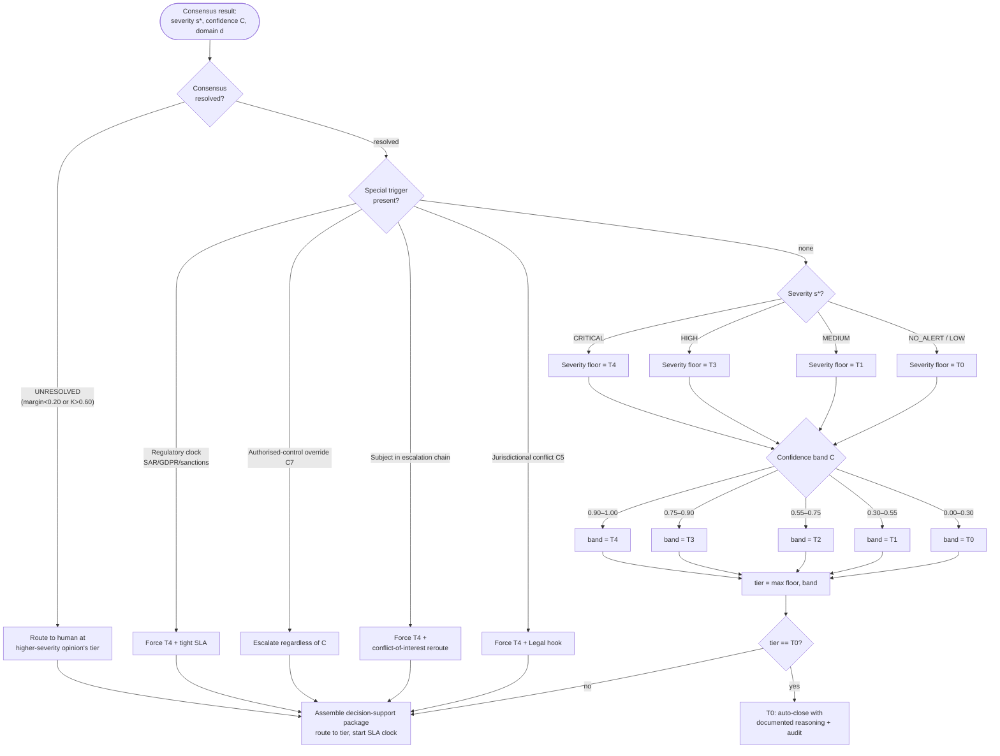

# Master Escalation Decision Tree

| Field | Value |
|---|---|
| **Document ID** | TREE-MASTER |
| **Deliverable** | D4 — Human-in-the-Loop Escalation Framework |
| **Version** | 1.0.0 · **Date** 2026-08-21 · **Author** Aman Singh |
| **Related** | [../escalation-framework.md](../escalation-framework.md) · [../../conflict-resolution/consensus-algorithm.md](../../conflict-resolution/consensus-algorithm.md) |

---

## What this tree decides

Every consensus result enters here. The tree computes the **routing tier** as `tier = max(confidence-band tier, severity-floor tier)`, then applies special triggers that can only *raise* it. Suppression (T0) is itself a logged decision, never a silent drop. This is the deterministic form of §3 of the framework — the reference implementation `src/escalation.py` walks exactly these branches.

## Reading the outcome

The two "raise-only" rules are the safety core: the **severity floor** guarantees a CRITICAL always reaches a Director even at modest confidence (cost of a miss dominates), and **special triggers** guarantee legal/conduct-sensitive cases (C5, C7, senior-subject, regulatory clock) reach T4 regardless of the arithmetic. Only a case that is both low-severity *and* low-confidence *and* trigger-free lands at T0 — and even then it is closed with written reasoning and an audit entry. After routing, the SLA clock ([../escalation-framework.md](../escalation-framework.md) §6) governs auto-re-escalation.

---
*End of TREE-MASTER v1.0.0*
