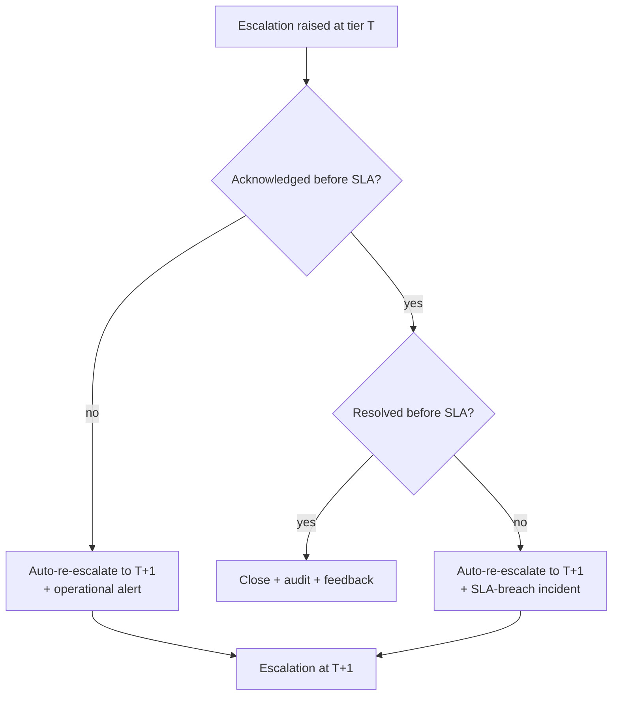
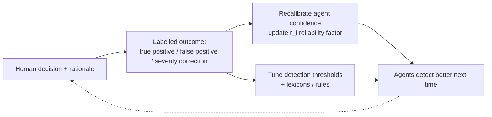

# D4 — Human-in-the-Loop Escalation Framework

| Field | Value |
|---|---|
| **Document ID** | ESCALATION-FRAMEWORK |
| **Deliverable** | D4 — Human-in-the-Loop Escalation Framework |
| **Version** | 1.0.0 |
| **Date** | 2026-08-21 |
| **Author** | Aman Singh |
| **Status** | Baseline |
| **Related** | [decision-trees/](decision-trees/) · [../conflict-resolution/consensus-algorithm.md](../conflict-resolution/consensus-algorithm.md) · [../agents/report-generator.md](../agents/report-generator.md) · reference impl `src/escalation.py` |

---

## 1. Principle

Agents **detect and recommend**; humans **decide and authorise**. No autonomous action with legal or customer consequence (filing a SAR, holding a transaction, sanctioning an employee) happens without a human in the loop at the appropriate level. The framework's job is to route the right case, to the right person, with the right evidence, within the right time — and to learn from what they decide.

## 2. Escalation tiers

| Tier | Role | Handles | Authority |
|---|---|---|---|
| **T0** | Automated (no human) | NO_ALERT suppressions, LOW informational, verified benign | auto-close with documented reasoning |
| **T1** | Compliance Analyst | MEDIUM findings, routine review | acknowledge, request info, resolve or promote |
| **T2** | Senior Analyst | HIGH findings, ambiguous MEDIUM, unresolved minor conflicts | as T1 + approve standard actions |
| **T3** | Compliance Manager | HIGH with action, cross-desk patterns, override requests | approve remediation, authorise holds (with dual control) |
| **T4** | Director / CCO | CRITICAL, senior-person subjects, cross-jurisdiction (C5), filing sign-off | authorise regulatory filing (dual sign-off), board escalation |
| **+** | Legal / Board hooks | Jurisdictional conflicts, privilege, senior-management conduct | legal determination; board risk committee |

Four human tiers (T1–T4) plus automated T0 and Legal/Board hooks — satisfying the "4+ tiers" requirement while keeping T0 explicit so *suppression is also a logged decision*.

## 3. Escalation triggers & thresholds

Tier is the **maximum** of (a) the confidence band and (b) the severity floor, then adjusted by special triggers. Constants live in `src/domain.py`.

### 3.1 Confidence bands (base tier)

| Confidence C | Base tier |
|---|---|
| 0.00–0.30 | T0 (log only) |
| 0.30–0.55 | T1 |
| 0.55–0.75 | T2 |
| 0.75–0.90 | T3 |
| 0.90–1.00 | T4 |

### 3.2 Severity floor (can only raise the tier)

`CRITICAL → T4`, `HIGH → T3`, `MEDIUM → T1`, `LOW/NO_ALERT → T0`. Severity **escalates, never de-escalates** the tier — a CRITICAL alert with modest confidence still reaches a Director, because the *cost of missing it* dominates.

### 3.3 Special triggers (override the computed tier)

| Trigger | Effect |
|---|---|
| Regulatory clock (SAR 24h, GDPR 72h, sanctions immediate) | force T4, set tight SLA |
| Subject is a senior manager / compliance officer | force T4 **and** conflict-of-interest rerouting (§7) |
| Cross-jurisdiction conflict (C5) | force T4 + Legal hook |
| Authorised-control override detected (C7) | escalate regardless of confidence |
| CS-18-type verified benign | T0 suppression **with** documented reasoning |

## 4. Decision-support package (what the human receives)

Every escalation carries a complete package so the reviewer never has to hunt for context (schema `escalation.case.v1`):

1. **Case summary** — one paragraph: what, who, when, how much.
2. **Severity & confidence** — with the consensus mechanism used and its inputs.
3. **Evidence bundle** — source references (not raw sensitive data): transactions, comm excerpts, reg citations, each with a pointer + hash.
4. **Per-agent assessments** — each agent's opinion and authority weight.
5. **Consensus result** — masses/scores/margin/K, or Bayesian posterior.
6. **Applicable regulations** — specific citations (e.g. SEC Rule 10b-5, FINRA 2111).
7. **Recommended action** — the System's suggestion (e.g. "file SAR within 24h").
8. **SLA clock** — acknowledge-by and resolve-by timestamps.
9. **Similar prior cases** — for consistency of human decisions.

## 5. Human override mechanism & authorisation

- A human at the case's tier (or above) may **confirm**, **downgrade**, **upgrade**, or **suppress** the System's recommendation.
- Any override requires **step-up authentication (MFA)** and a **mandatory free-text rationale** — an override with no reason is rejected by the UI.
- **Dual control:** downgrading a CRITICAL, or authorising any regulatory filing, requires a **second approver** at T4 (separation of duties).
- Overrides above T2 notify the next tier for awareness (not approval), preventing quiet single-actor suppression — the JPMorgan lesson.
- Every override is a signed audit event: who, when, from-state → to-state, rationale.

## 6. SLAs & auto-re-escalation

| Severity | Acknowledge | Resolve |
|---|---|---|
| CRITICAL | 15 min | 24 h |
| HIGH | 1 h | 72 h |
| MEDIUM | 4 h | 5 business days |
| LOW | 1 business day | 10 business days |

If an acknowledge or resolve SLA is missed, the case **auto-re-escalates one tier** and raises an operational alert; unbroken misses climb to T4 and then to the board hook. The SLA clock and every re-escalation are audited (regulators inspect time-to-detection and time-to-resolution).

## 7. Conflict-of-interest rerouting

If a case's *subject* is a member of the normal escalation chain (e.g. the Compliance Manager who would review it is the person under suspicion — Case Study 5, where compliance officers themselves used off-channel comms), the Escalation Manager **reroutes around** that person to an independent reviewer at the same or higher tier, and flags the exception to Legal. The chain is computed from an org-relationship graph, so the System never asks someone to adjudicate their own conduct.

## 8. Feedback loop (humans improve the agents)

Every human decision is a labelled example:

- Confirmed false positives lower the agent's confidence for that pattern (raise `r_i` penalty), directly attacking the Head-of-Trading persona's concern about false-positive load.
- Confirmed true positives and severity corrections tune thresholds and lexicons.
- Changes are **versioned and reviewed** — the loop never silently auto-mutates detection logic in production; a human approves calibration changes, preserving determinism and auditability.

## 9. How this satisfies the Review Board

Regulatory Affairs: complete, time-stamped decision chain with SLAs. General Counsel: human authority + dual control + rationale on every consequential action = legal defensibility. Head of Trading: feedback loop drives false positives down. External Auditor: every escalation, override, and suppression is a signed audit event. CTO: deterministic, replayable routing.

---
*End of ESCALATION-FRAMEWORK v1.0.0*
