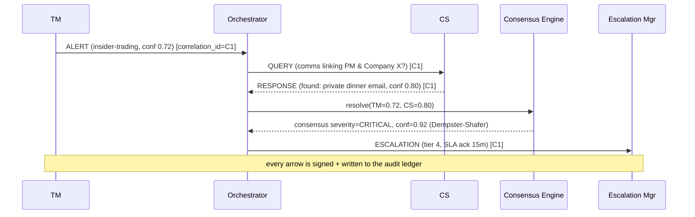

# D2.1 — Inter-Agent Communication Protocol

| Field | Value |
|---|---|
| **Document ID** | PROTO-COMMS |
| **Deliverable** | D2 — Inter-Agent Communication Protocol |
| **Version** | 1.0.0 |
| **Date** | 2026-08-21 |
| **Author** | Aman Singh |
| **Status** | Baseline |
| **Related** | [message-schema.json](message-schema.json) · [routing-logic.md](routing-logic.md) · [../architecture/security-architecture.md](../architecture/security-architecture.md) |

---

## 1. Purpose

Defines *how agents talk*: the message envelope, the six message types, versioning, delivery guarantees, and flow control. The machine-readable contract is [message-schema.json](message-schema.json); this document is its human companion and rationale.

## 2. Envelope

Every message — regardless of type or transport — is wrapped in one envelope (Appendix B of the spec). Fields and why each exists:

| Field | Type | Req. | Purpose |
|---|---|---|---|
| `message_id` | UUID v4 | ✔ | De-duplication, referencing |
| `protocol_version` | semver | ✔ | Compatibility negotiation (§5) |
| `timestamp` | ISO-8601 UTC ms | ✔ | Temporal integrity (audit) |
| `sender_agent_id` | AgentID | ✔ | Attribution |
| `recipient_agent_id` | AgentID / array | ✔ | Unicast or multicast |
| `message_type` | enum | ✔ | Intent (see §3) |
| `priority` | 1–5 | ✔ | Transport QoS (§ routing-logic) |
| `correlation_id` | UUID v4 | cond. | Ties a case together across hops/time |
| `trace_id` | UUID v4 | ✔ | Distributed tracing (observability) |
| `payload_schema` | string | ✔ | Selects payload structure/version |
| `payload` | object | ✔ | The actual content |
| `confidence_score` | 0.0–1.0 | cond. | Required on detection ALERT/RESPONSE |
| `ttl_seconds` | int | ✔ | Staleness/replay guard |
| `retry_count` | int | ✔ | Delivery attempt tracking |
| `audit_classification` | enum | ✔ | Retention tier (REGULATORY/OPERATIONAL/DIAGNOSTIC) |
| `sender_signature` | base64 | ✔ | Authenticity + non-repudiation |
| `nonce` | string | ✔ | Replay prevention |

**`correlation_id` vs `trace_id` (a common exam question):** `trace_id` is a *technical* tracing id for one delivery path (observability/OpenTelemetry). `correlation_id` is a *business* id for one compliance case — it may span many messages, many agents, and hours or weeks (e.g. a case that starts in the streaming lane and is confirmed by a batch job). One case = one `correlation_id`; many `trace_id`s.

## 3. Message types

| Type | Direction (typical) | Semantics | Payload schema example |
|---|---|---|---|
| `ALERT` | agent → ORCH | "I detected a possible violation." Carries severity, evidence, confidence. | `alert.detection.v1` |
| `QUERY` | ORCH → agent | "Give me corroborating evidence about X." | `query.corroboration.v1` |
| `RESPONSE` | agent → ORCH | Reply to a QUERY. | `response.corroboration.v1` |
| `UPDATE` | RU → all | "A regulation changed — recalibrate/observe." | `update.regulatory.v1` |
| `HEARTBEAT` | agent → ORCH/health | Liveness + load + latency. | `heartbeat.status.v1` |
| `ESCALATION` | ORCH → Escalation Mgr | "Route this case to a human tier." | `escalation.case.v1` |

### 3.1 Canonical conversation (ALERT → QUERY → RESPONSE → ESCALATION)

## 4. Delivery guarantees

- **At-least-once** delivery with idempotent consumers (dedupe on `message_id`). Compliance cannot tolerate *lost* messages; duplicates are cheap to discard.
- **Ordering** is guaranteed *per `correlation_id`* (Kafka partition key), not globally. Agents must not assume global ordering.
- **Durability**: messages on `transactions`/`communications`/`agent-messages`/`escalations` are persisted (replication ≥ 3) before acknowledgement — the backbone is the system of record.
- **Acknowledgement**: consumers commit offsets only after the action is audited; a crash before commit replays the message (no silent loss).

## 5. Protocol versioning

- `protocol_version` uses **semantic versioning**. Minor/patch bumps are backward-compatible (additive fields); a major bump signals a breaking change.
- Agents advertise supported ranges; the Orchestrator negotiates the highest common version. Unknown *additive* fields are ignored by older agents (forward-compatible envelopes).
- `payload_schema` is versioned independently (`alert.detection.v1` → `.v2`) so a single payload type can evolve without a protocol-wide bump. A Schema Registry enforces compatibility at publish time.

## 6. Bandwidth management & back-pressure

- **Priority lanes:** priority 1–2 (CRITICAL/HIGH) traffic uses dedicated high-priority partitions/consumers and is never shed. Priority 4–5 can be throttled or spilled under load.
- **Back-pressure:** consumer lag is the pressure signal; sustained lag triggers autoscaling, then (at the ceiling) load-shedding of low-priority traffic to a spill topic for off-peak replay. Full policy in [routing-logic.md](routing-logic.md).
- **Batching:** low-priority informational messages (e.g. bulk HEARTBEAT aggregates) may be batched to save bandwidth; CRITICAL messages are always sent immediately, unbatched.

## 7. Security binding

Authenticity, integrity, replay-prevention and encryption of these messages are specified in [../architecture/security-architecture.md](../architecture/security-architecture.md) §3–§5 (mTLS transport + per-message ECDSA signature + nonce/TTL). The protocol layer *requires* a valid `sender_signature` and unspent `nonce`; messages failing either are rejected and audited as security events.

---
*End of PROTO-COMMS v1.0.0*
