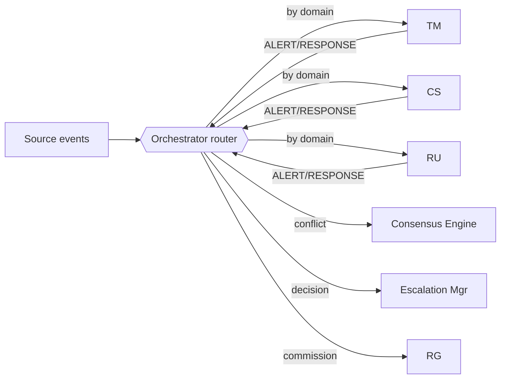
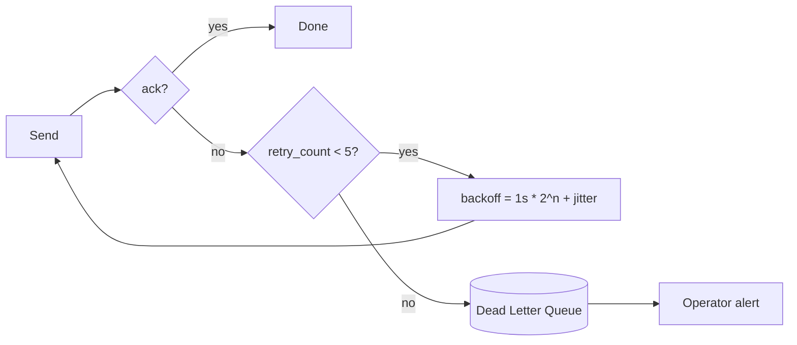

# D2.2 — Routing Logic, Priority & Error Handling

| Field | Value |
|---|---|
| **Document ID** | PROTO-ROUTING |
| **Deliverable** | D2 — Inter-Agent Communication Protocol |
| **Version** | 1.0.0 |
| **Date** | 2026-08-21 |
| **Author** | Aman Singh |
| **Status** | Baseline |
| **Related** | [communication-protocol.md](communication-protocol.md) · [../architecture/failure-modes.md](../architecture/failure-modes.md) |

---

## 1. Routing model

Routing is **topic-based publish/subscribe mediated by the Orchestrator**, not direct agent-to-agent addressing. Rationale: a mediated hub keeps the decision chain reconstructable (auditability) and lets us add/remove agents without rewiring peers. Direct request/response (`QUERY`/`RESPONSE`) is still point-to-point but is *initiated* through the Orchestrator so the case record stays complete.

### 1.1 Routing rules (event → agent)

| Condition on event | Route to | Notes |
|---|---|---|
| topic = `transactions` | TM | + CS/RU on QUERY |
| topic = `communications` | CS | + TM on QUERY |
| topic = `reg-updates` | RU | RU may broadcast `UPDATE` to TM/CS |
| ALERT.severity ∈ {CRITICAL, HIGH} | Escalation Mgr immediately, in parallel with corroboration | never wait on batch to raise CRITICAL |
| two agents ALERT on same `correlation_id` with divergent severity | Consensus Engine | see D3 |
| ALERT.violation touches ≥2 jurisdictions | RU (conflict check) + Consensus | see CS-19 |

## 2. Priority classification (5 levels + SLAs)

Priority is set from severity via the deterministic map in `src/domain.py`. SLAs are the **acknowledge/resolve** clocks the Escalation Manager enforces.

| Priority | Level | Maps from severity | Transport handling | Ack SLA | Resolve SLA | Rationale |
|---|---|---|---|---|---|---|
| 1 | CRITICAL | CRITICAL | dedicated lane, never shed, immediate | 15 min | 24 h | SAR / sanctions clocks |
| 2 | HIGH | HIGH | high-priority lane, never shed | 1 h | 72 h | GDPR breach 72h; serious violations |
| 3 | MEDIUM | MEDIUM | normal lane | 4 h | 5 business days | assessment needed |
| 4 | LOW | LOW | normal lane, sheddable under load | 1 business day | 10 business days | minor findings |
| 5 | INFORMATIONAL | NO_ALERT / status | batchable, sheddable | none | none | logging, heartbeats |

**Escalation-on-SLA-miss:** if an acknowledge SLA is missed, the case auto-re-escalates one tier and raises an operational alert (see [../escalation/escalation-framework.md](../escalation/escalation-framework.md) §Auto-re-escalation).

## 3. Error handling

### 3.1 Timeouts
Each `QUERY` carries an implicit deadline = min(`ttl_seconds`, type default). If no `RESPONSE` before the deadline, the Orchestrator proceeds on available evidence and records `corroboration=timeout` — a missing corroboration lowers confidence but never blocks a CRITICAL escalation (fail-safe: absence of exculpatory evidence does not downgrade a critical alert below human review).

### 3.2 Retry with exponential backoff
Transient delivery/processing failures retry: **base 1 s, factor ×2, max 5 attempts, jitter 0–500 ms.** `retry_count` increments each attempt (visible in the envelope for observability). Sequence: 1s → 2s → 4s → 8s → 16s (+jitter), then DLQ.

### 3.3 Dead Letter Queue (DLQ)
A message exhausting retries is moved to a DLQ with full envelope + failure reason + `trace_id`. DLQ items: (a) raise an operator alert, (b) are audit-classified (never silently dropped), (c) are re-drivable after the fault is fixed. A rising DLQ depth is a monitored SLO on the System Health panel.

### 3.4 Poison-message protection
A message that repeatedly crashes a consumer is quarantined to the DLQ after the first crash-loop detection (not retried 5×), preventing one malformed message from stalling a partition.

### 3.5 Idempotency
Consumers dedupe on `message_id` and treat processing as idempotent, so at-least-once delivery + retries cannot double-count a detection or double-file a report.

## 4. Back-pressure & load shedding

| Signal | Threshold | Action |
|---|---|---|
| consumer lag | > 30 s | autoscale consumer group up |
| queue depth | > 80% capacity | WARN on dashboard |
| queue depth | > 95% capacity | CRITICAL; begin shedding priority 4–5 to spill topic |
| spill topic | any | replay off-peak; items retain original priority + timestamps |

**Invariant:** priority 1–2 messages are *never* shed, batched-with-delay, or dropped. Under maximum stress the System sheds only low-value informational/low traffic and always preserves critical compliance signals — the property tested by the stress scenario and asserted in code.

## 5. Routing audit

Every routing decision (which agent(s) a message went to, priority assigned, retries, DLQ moves, shedding events) is written to the audit ledger with the `correlation_id`, so an examiner can reconstruct not just *what* was decided but *how the message got there*.

---
*End of PROTO-ROUTING v1.0.0*
